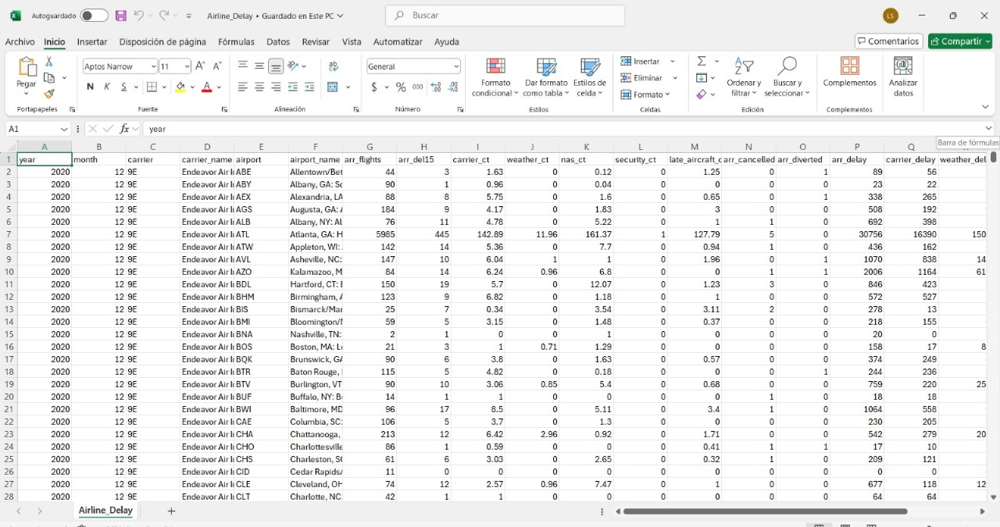

# Airline Data Analytics with Amazon Athena

This project demonstrates how to use **Amazon Athena** to analyze CSV data files stored in Amazon S3 without needing to load them into a database. Athena allows querying data directly from S3 using standard SQL syntax.

### Objective

The objective of this project is to showcase how Amazon Athena can be used to query structured and semi-structured data in S3. The steps include uploading data to S3, configuring Athena, and executing SQL queries to explore flight delay information and sports-related datasets.

---

## Table of Contents

- [Architecture](#architecture)
- [Cost](#cost)
- [Deployment](#deployment)
- [Monitoring](#monitoring)
- [Security](#security)
- [Learn More](#learn-more)

---

## Architecture

The architecture of this project includes the following AWS components:

- **S3 Buckets**: Store CSV files for analysis.
- **Amazon Athena**: Provides a serverless query service using standard SQL.
- **AWS Glue Data Catalog**: Maintains metadata for tables and views.
- **IAM Roles/Policies**: Manage access to resources.
- **CloudWatch**: Used for logging Athena query results and access events.


---

## Cost

The cost estimation is based on Athena and S3 usage:

### 1. **Athena Queries**

- $5.00 per TB of data scanned
- Estimating <1 GB scanned in test queries: **~$0.01**

### 2. **S3 Storage**

- Standard storage: $0.023 per GB/month
- Assuming 1 GB stored for 1 month: **~$0.023**

### 3. **CloudWatch Logs**

- Low usage (~10 MB logs): **~$0.005**

**Total Estimated Cost**: ~**$0.04 USD** for small-scale testing

---

## Deployment

The deployment of this project consists of the following steps:

1. **Upload CSV Files to S3**
   First, an S3 bucket named laboratorio-athena-lscg-202502 was created. During the creation process, the following settings were configured:

   Bucket Name: laboratorio-athena-lscg-202502

   Region: (selected based on geographic preference)

   Access Configuration: Block all public access (for security purposes)

   After creating the bucket, two prefixes (folders) were created:

   result/ → used to store the results of Athena queries.

   airline_delay/ → used to store the CSV datasets related to flight delays.

   The flight delay datasets (CSV files) were then uploaded into the airline_delay/ prefix.


2. **(Optional) Preview Data in Excel**
   The dataset was then opened in Excel to review its structure and validate its contents.

   

3. **Configure Athena Result Location**
   The output location for Athena query results was set to the result/ prefix inside the created bucket, for example: s3://laboratorio-athena-lscg-202502/result/.

   

4. **Run Query Directly on CSV**
   Athena was then used to run SQL queries directly over the CSV file, without the need to create a table.

   ```sql
   SELECT carrier_name FROM flight_delay_csv;
   ```

   

5. **Create Table in Athena from CSV**
   A table schema was defined and mapped to the file stored in S3.

   ```sql
   CREATE TABLE new_table
   WITH
   {
    format - 'Parquet',
    write_compression - 'SNAPPY',
    external_location = 's3://laboratorio-athena-lscg-202503/Airline_Delay/output/'
   }
   AS SELECT * FROM flight_delays_csv
   ```

   

6. **Query Created Table**
   SQL queries were executed over the newly created table.

   ```sql
   SELECT * FROM new_table;
   ```

   

7. **Query an Athena View**
   A query was performed on a view created from one or more tables.

   ```sql
   SELECT carrier_name FROM view_table;
   ```

   

8. **Analyze Sports Dataset**
   Complex queries were executed by joining multiple sports-related tables.

   ```sql
    SELECT
    e.id AS event_id,
    e.sport_type_name AS sport,
    e.start_date_time AS event_date_time,
    h.name AS home_team,
    a.name AS away_team,
    l.name AS location,
    l.city
    FROM parquet_sport_event e,
    parquet_sport_team h,
    parquet_sport_team a,
    parquet_sport_location l
    WHERE e.home_team_id = h.id
    AND e.away_team_id = a.id
    AND e.location_id = l.id;
   ```

   ```sql
    SELECT t.id AS ticket_id,
    e.event_id,
    e.sport,
    e.event_date_time,
    e.home_team,
    e.away_team,
    e.location,
    e.city,
    t.seat_level,
    t.seat_section,
    t.seat_row,
    t.seat,
    t.ticket_price,
    p.full_name AS ticketholder
    FROM sporting_event_info e,
    parquet_sporting_event_ticket t,
    parquet_person p;
   ```

   
   
   
   

---

## Monitoring

Monitoring is done using:

- **Athena Query History**: Tracks all queries and their performance.
- **CloudWatch**: Captures query logs and alerts for failures or anomalies.

---

## Security

Security best practices implemented in this project:

- **S3 Bucket Policies**: Control access to uploaded datasets.
- **IAM Permissions**: Fine-grained permissions for Athena and S3 access.
- **Athena Workgroups**: Isolate and manage user/query permissions.

---

## Learn More

Explore more about the tools and services used:

- [Amazon Athena Documentation](https://docs.aws.amazon.com/athena/)
- [Amazon S3 Documentation](https://docs.aws.amazon.com/s3/)
- [AWS Glue Data Catalog](https://docs.aws.amazon.com/glue/)
- [AWS CloudWatch Documentation](https://docs.aws.amazon.com/cloudwatch/)
