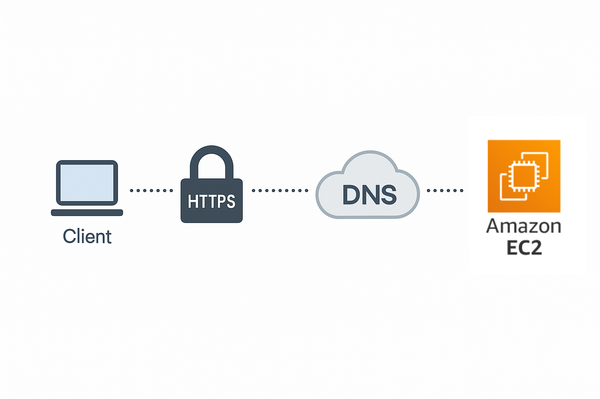
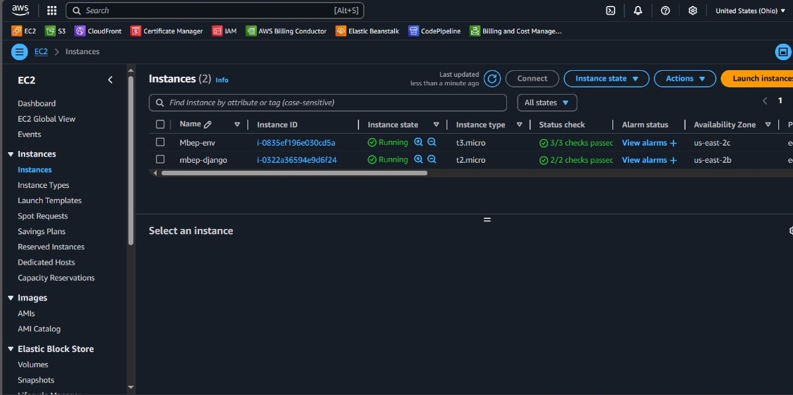
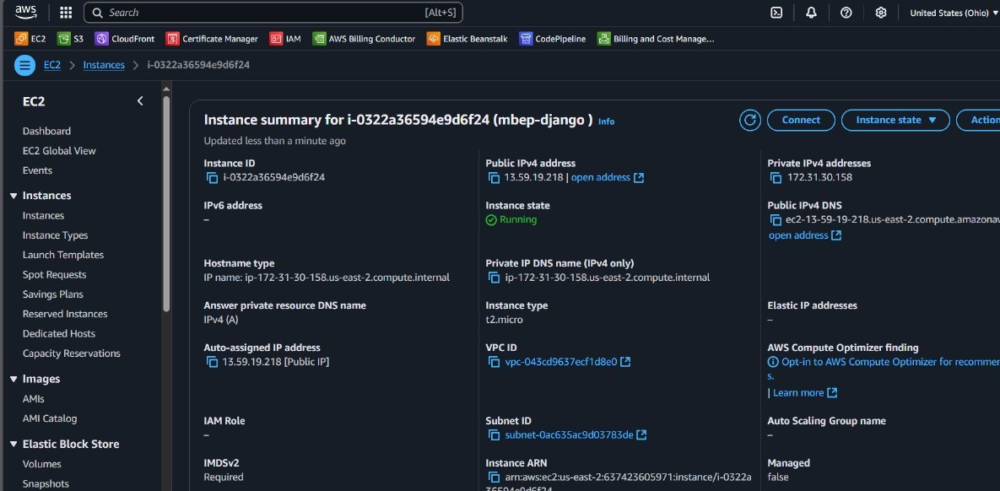
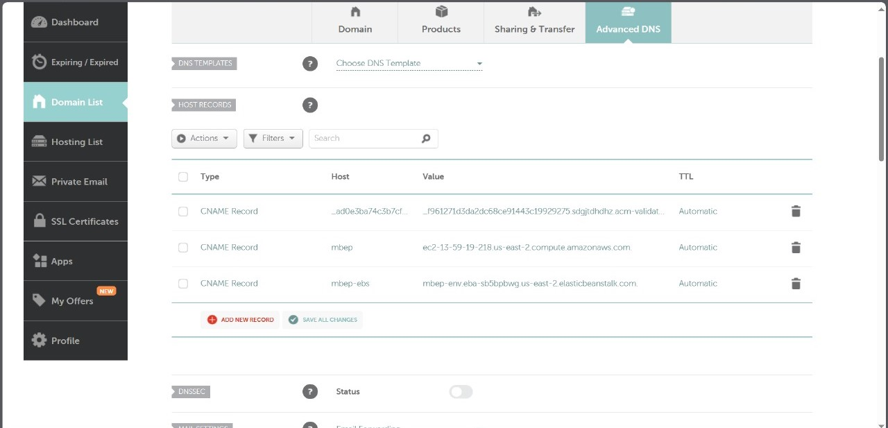
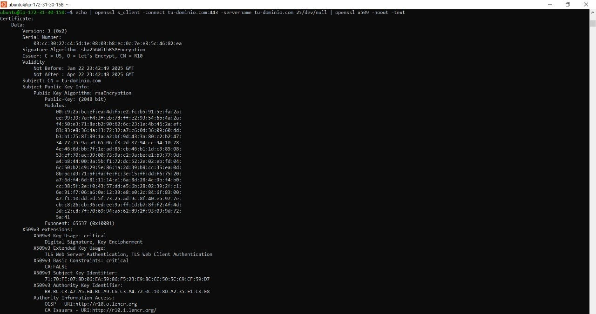
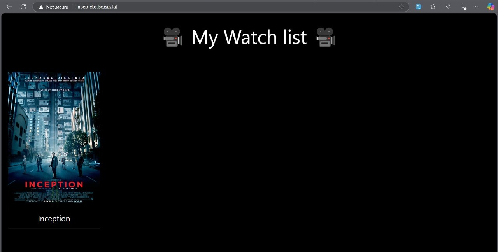
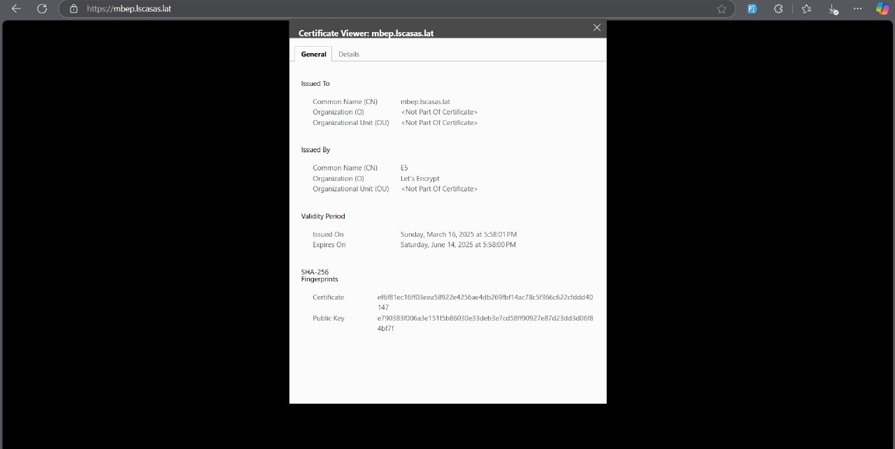

# Secure Deployment of a Web Application with Amazon EC2 and SSL (Client Server Architecture)

This project demonstrates how to deploy a Django-based web application using an Amazon EC2 instance and secure it using HTTPS with a Let's Encrypt SSL certificate. The process includes setting up the EC2 instance, configuring DNS, deploying the app, and implementing SSL encryption.

### Objective

The objective of this project is to showcase the steps to securely deploy a web application in the cloud using Amazon EC2 and SSL certificates from Let's Encrypt, ensuring safe communication over the internet.

---

## Table of Contents

- [Architecture](#architecture)
- [Cost](#cost)
- [Deployment](#deployment)
- [Monitoring](#monitoring)
- [Security](#security)
- [Learn More](#learn-more)

---

## Architecture

The architecture of this project includes the following components:

- **Amazon EC2**: Hosts the Django web application.
- **Public DNS and IP**: Used to access the application from the internet.
- **Domain Configuration**: DNS records set up to point to EC2 public DNS.
- **Let’s Encrypt SSL**: Provides HTTPS encryption for secure access.

---

## Cost

This project uses **Amazon EC2** and **Let’s Encrypt** (free SSL). The estimated cost for a **t2.micro EC2 instance (Free Tier eligible)** is minimal if within AWS Free Tier usage limits. Additional costs could arise from:

- EC2 running time (if outside Free Tier)
- Data transfer

---

## Deployment

To deploy the application securely with HTTPS, follow these steps:

### 1. **Launch EC2 Instance**

- Access the EC2 dashboard and create a new instance (Amazon Linux or Ubuntu).
- Open necessary ports (22 for SSH, 80 for HTTP, 443 for HTTPS).

### 2. **View Instance Details**

- Take note of the public DNS and IP address to use in DNS configuration and browser access.

### 3. **Configure Domain DNS**

- In your domain provider (e.g., Namecheap), set CNAME or A records pointing to the EC2 public DNS or IP.
- Use subdomain like `mbep.incesa.lat`.

### 4. **Deploy the Web Application**

- SSH into your EC2 instance and install necessary packages (Python, Django, Gunicorn, Nginx).
- Deploy the Django project (e.g., a movie listing app).

### 5. **Install and Configure SSL with Let’s Encrypt**

- Use Certbot to generate and install SSL certificates for your domain.
- Auto-renewal setup is recommended.

### 6. **Test HTTPS Access**

- Access your site via `https://mbep.incesa.lat` and confirm it loads with secure connection.

### 7. **Verify Certificate**

- Click the lock icon in the browser and inspect certificate details.
- Check issuer, expiration, and domain coverage.

---

## Monitoring

To monitor application and server status:

- **EC2 Monitoring Tools**: View CPU, disk, and network metrics in AWS.
- **System Logs**: Use `journalctl`, `nginx logs`, and `gunicorn logs` for debugging.

---

## Security

Security best practices implemented include:

1. **Use of HTTPS**:

   - Encrypts traffic using SSL from Let’s Encrypt.

2. **Minimal Ports Opened**:

   - Only essential ports (22, 80, 443) opened via Security Groups.

3. **IAM Roles and Least Privilege**:

   - Use IAM roles for EC2 (if needed) to restrict permissions.

4. **Auto SSL Renewal**:
   - Certbot configured to auto-renew SSL certificates regularly.

---

## Learn More

- [Amazon EC2 Documentation](https://docs.aws.amazon.com/ec2/)
- [Certbot (Let’s Encrypt) Documentation](https://certbot.eff.org/)
- [Namecheap DNS Configuration Guide](https://www.namecheap.com/support/knowledgebase/)
