# AWS DMS - Migrating Data from RDS to S3

This project documents a hands-on lab that demonstrates the use of **AWS Database Migration Service (DMS)** to migrate data from a **PostgreSQL RDS** database to **Amazon S3**. The setup includes creating a VPC, configuring endpoints, and launching a replication task.

---

### Objective

The objective of this lab is to practice data migration using AWS DMS with the following goals:

- Set up a VPC and networking components with CloudFormation.
- Deploy an RDS instance with test data.
- Create endpoints for source (RDS) and target (S3).
- Launch a DMS replication instance and task.
- Validate the migration by inspecting the S3 bucket.

---

## Table of Contents

- [Architecture](#architecture)
- [Cost](#cost)
- [Deployment](#deployment)
- [Monitoring](#monitoring)
- [Security](#security)
- [Learn More](#learn-more)

---

## Architecture

The architecture consists of the following AWS components:

- **VPC**: Custom VPC with private/public subnets.
- **Subnet Group**: For DMS to deploy the replication instance.
- **RDS PostgreSQL**: Source database with sample data.
- **Amazon S3**: Destination to store migrated data.
- **DMS Replication Instance**: Service that handles the data migration.
- **DMS Endpoints**: Defines the source and destination of data.
- **DMS Task**: Configuration of how data is transferred.

---

## Cost

### 1. **DMS Replication Instance**

- dms.t3.medium (~$0.036/hour)

### 2. **RDS PostgreSQL (free-tier eligible)**

### 3. **S3 Storage**

- Pay per GB stored and number of requests

**Estimated Total**: ~$1.00 for short usage

---

## Deployment

### 1. **VPC and Resources via CloudFormation**

A pre-built AWS CloudFormation template was used to provision the core infrastructure required for the lab environment. This included:

- A dedicated Virtual Private Cloud (VPC) with an appropriate CIDR block.
- Public and private subnets across multiple Availability Zones to support high availability.
- An Internet Gateway and a NAT Gateway to enable both public access and controlled outbound internet access for private resources.
- Route tables associated with each subnet to ensure correct traffic flow.
- Security groups with predefined rules to allow SSH, PostgreSQL, and DMS traffic.
- An Amazon RDS PostgreSQL instance preloaded with sample data in the `dms_sample` schema.

All these resources were successfully provisioned, verified through the AWS Management Console, and confirmed to be in a healthy state.

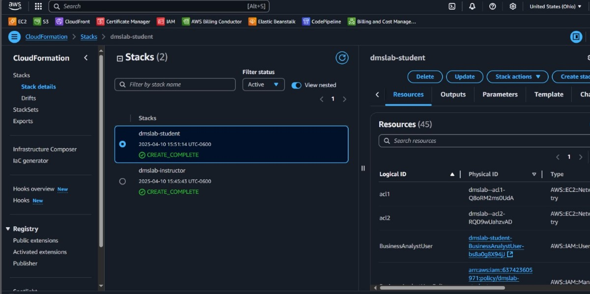

---

### 2. **Subnet Group for DMS**

A subnet group specifically for AWS DMS was created through the AWS DMS console. Steps included:

- Navigating to the **Subnet groups** section under the DMS service.
- Clicking **Create subnet group**, assigning a name like `dms-lab-subnet-grp`, and selecting the VPC ending with `dmslstudv1`.
- Choosing two private subnets from different Availability Zones to ensure high availability, then clicking **Add** and **Create subnet group**.

The console displayed the status as **Complete**, confirming the group was ready for use by the replication instance.

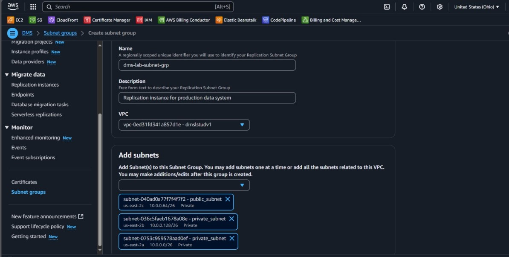

---

### 3. **Create DMS Replication Instance**

We launched a DMS replication instance from the **Replication instances** section:

- Named the instance `DMS-Replication-Instance` and gave it a meaningful description.
- Selected `dms.t3.medium` as the instance class, which is sufficient for labs or small data loads.
- Selected the latest engine version and chose “Dev or test workload (Single-AZ)” for high availability.
- Chose the same VPC and selected the security group with `sgdefault` from earlier steps.
- Left the other settings at default and clicked **Create replication instance**.

The instance took approximately 10–15 minutes to become **Available**, after which we continued with endpoint creation.

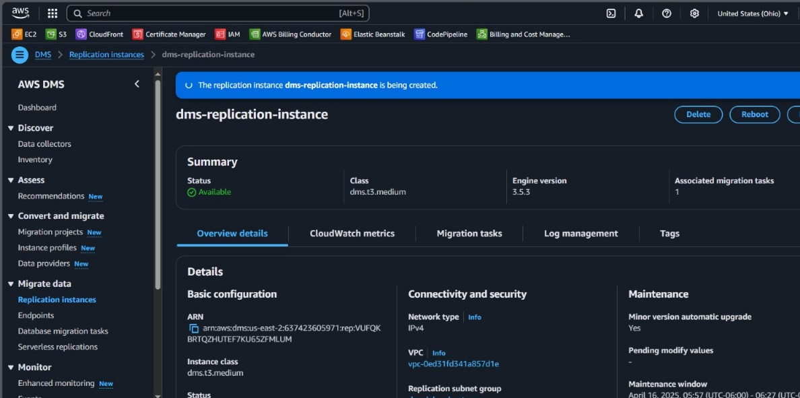

---

### 4. **Create Source and Target Endpoints**

**Source Endpoint:**

- Chose **Source** for endpoint type.
- Set identifier to `rds-source-endpoint`, engine as PostgreSQL.
- Provided manual access credentials: server name from the RDS instance, port `5432`, username `adminuser`, password `admin123`, and database `sportstickets`.
- SSL mode was set to `require`.

**Target Endpoint:**

- Chose **Target** for endpoint type.
- Set identifier to `s3-target-endpoint`, engine as Amazon S3.
- Provided the S3 bucket path in the form `s3://<bucket-name>/tickets`.
- Attached IAM role `DMSLabRoleS3` with permissions to write to the bucket.
- Under **Extra connection attributes**, added `addColumnName=true` to include column headers.

Both endpoints were created successfully.

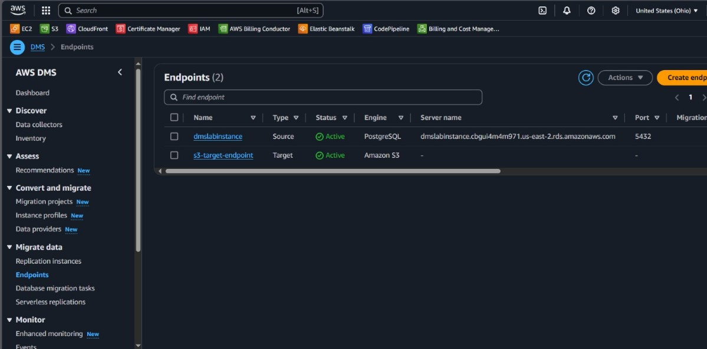

---

### 5. **Test Endpoint Connections**

To ensure that the network and authentication were set up correctly, we tested both endpoints:

- Selected each endpoint and clicked **Test connection** from the **Actions** menu.
- The source endpoint test validated access to the RDS PostgreSQL database.
- The target endpoint test validated access to the specified S3 bucket via the IAM role.

Both tests returned: **“Connection tested successfully”**. Any failed test was checked against security group rules and credential configuration.

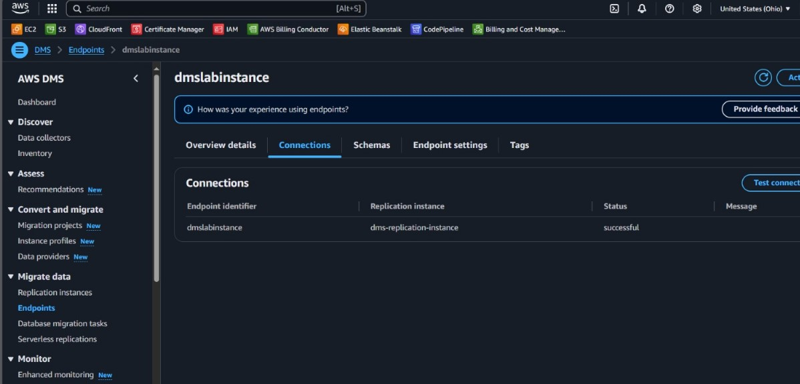
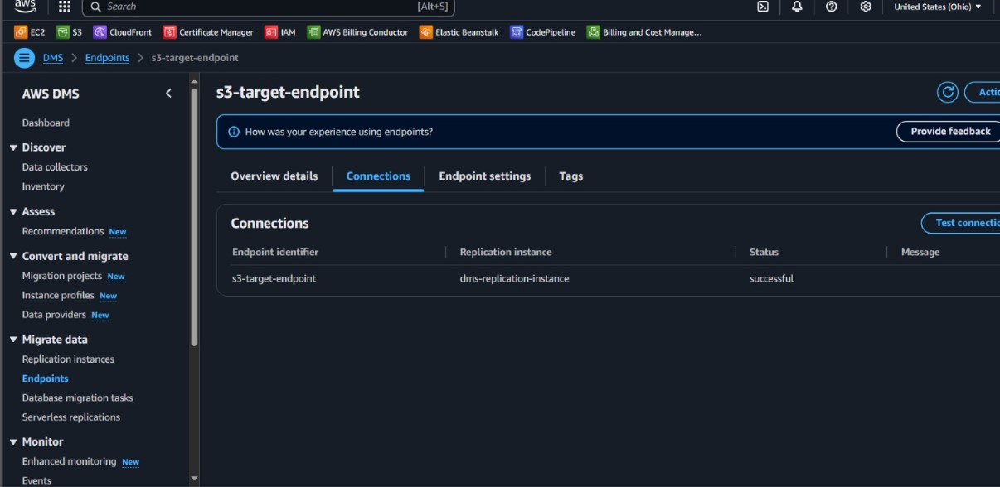

---

### 6. **Access RDS with SQL Client**

Using **Beekeeper Studio**, a SQL GUI tool, we connected directly to the Amazon RDS PostgreSQL instance:

- Entered the RDS endpoint, port 5432, username and password.
- Once connected, we browsed the schema `dms_sample`, validating that tables like `player` and `sporting_event_ticket` contained records.
- Sample queries were executed to preview data which would later be migrated.

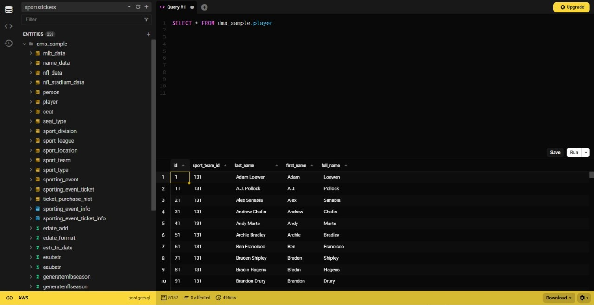

---

### 7. **Create and Run Migration Task**

We created a full-load migration task to migrate initial data:

- Navigated to **Database migration tasks** and clicked **Create task**.
- Named it `dms-full-dump-task`.
- Selected the replication instance, source endpoint, and target endpoint.
- Enabled **CloudWatch logs** for troubleshooting.
- Under **Table mappings**, defined a rule to include all tables under the `dms_sample` schema.
- Disabled the premigration assessment to save time.
- Created the task, which auto-started and began data extraction to the S3 bucket.

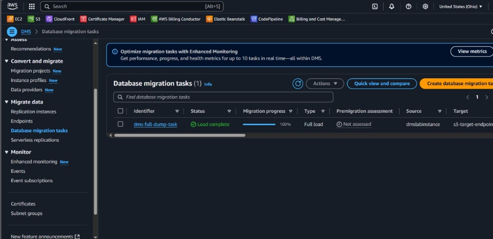

---

### 8. **Monitor Task Status and Progress**

The task was monitored in real-time:

- Progress showed percentage of rows completed.
- Table statistics, row counts, and latency were observed.
- Logs in CloudWatch were inspected in case of warnings.
- Task status updated to **100% complete**, confirming successful full data load.

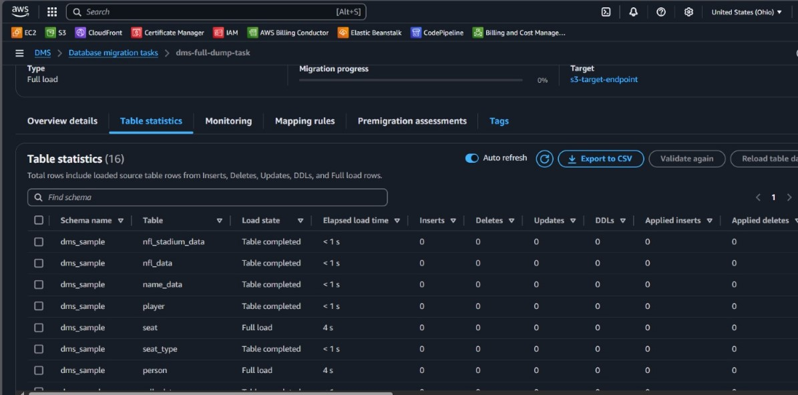

---

### 9. **Validate Data in S3 Bucket**

We accessed the S3 bucket via the S3 console and verified:

- Folder hierarchy: `bucket-name/tickets/dms_sample/table_name/`
- Each table had one or more CSV files containing exported rows.
- Column headers were included as per the `addColumnName=true` attribute.
- Using **S3 Select**, we ran simple SQL queries (e.g., `SELECT * FROM S3Object LIMIT 5`) on the `player` file to confirm file readability and correctness.

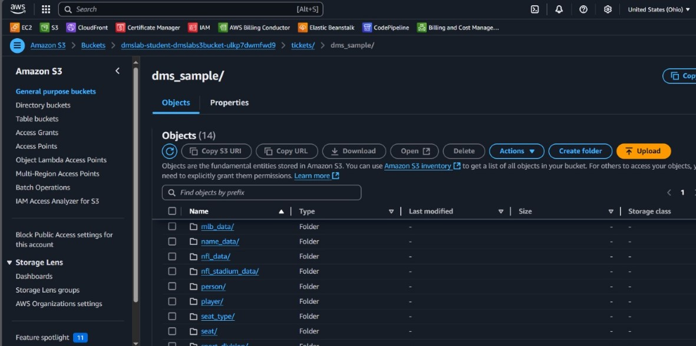

---

### 10. **Database Access from External Clients**

To simulate external client access:

- We used Beekeeper Studio to connect via the RDS public endpoint.
- Executed SELECT queries to verify that all expected tables and data were present.
- Ensured that access through the public endpoint respected the security group rules.

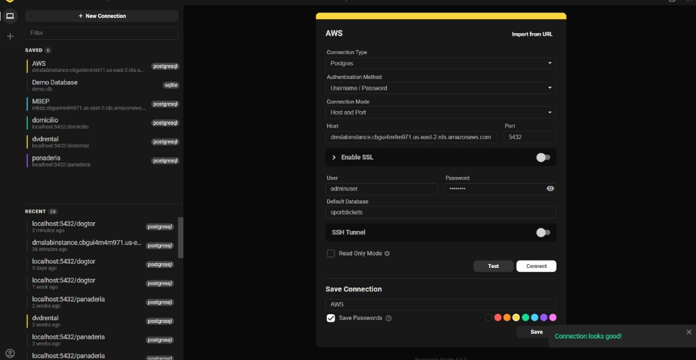

---

### 11. **Check EC2 Instance (Optional Client Access)**

As part of the CloudFormation template, an EC2 instance was optionally deployed:

- The instance served as a jumpbox for testing internal connectivity.
- We SSH’d into the instance using the private key.
- From within the instance, `psql` and other tools like DBeaver could be installed to test access to RDS and inspect S3 contents using the AWS CLI.

This allowed testing of internal paths and IAM role usage from within the VPC.

## 

## Monitoring

- **DMS Console**: Used to monitor task progress, endpoint connection status, and table load statistics.
- **SQL Tools**: Verified data availability and correctness before/after migration.

---

## Security

- **Security Groups**: Configured for access to RDS and DMS.
- **IAM Roles**: Role for DMS to write to S3 bucket.
- **VPC Configuration**: Ensured endpoints and replication instance were within the same VPC.

---

## Learn More

- [AWS DMS Documentation](https://docs.aws.amazon.com/dms/)
- [DMS Migration Lab](https://catalog.us-east-1.prod.workshops.aws/workshops/976050cc-0606-4b23-b49f-ca7b8ac4b153/en-US/400/401/430-main-lab)
- [Amazon S3](https://docs.aws.amazon.com/s3/)
- [Amazon RDS for PostgreSQL](https://docs.aws.amazon.com/AmazonRDS/latest/UserGuide/CHAP_PostgreSQL.html)
