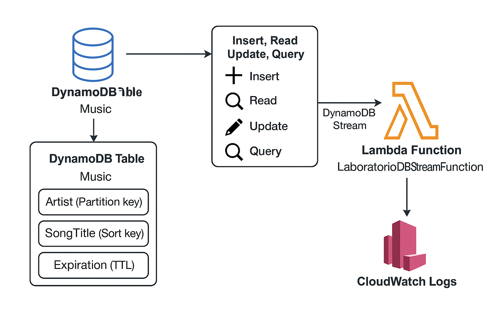
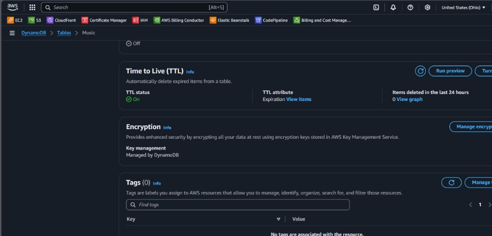
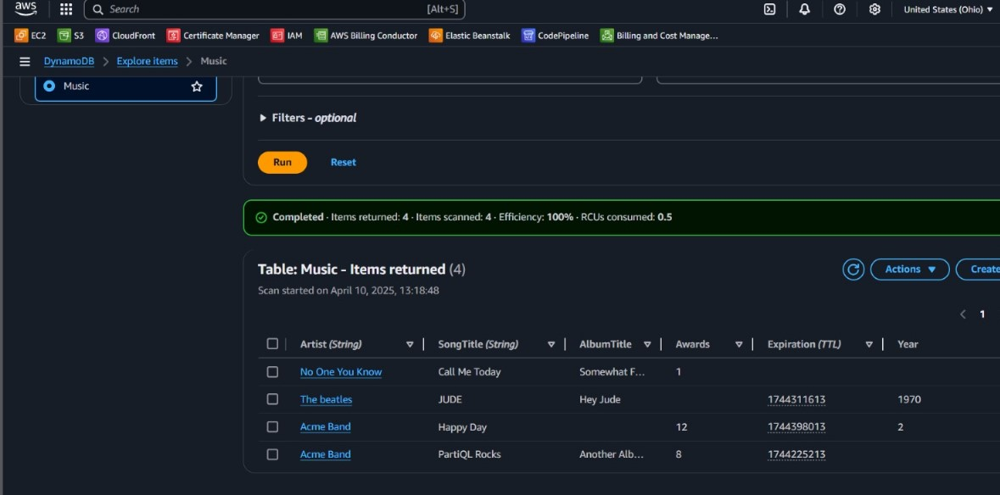
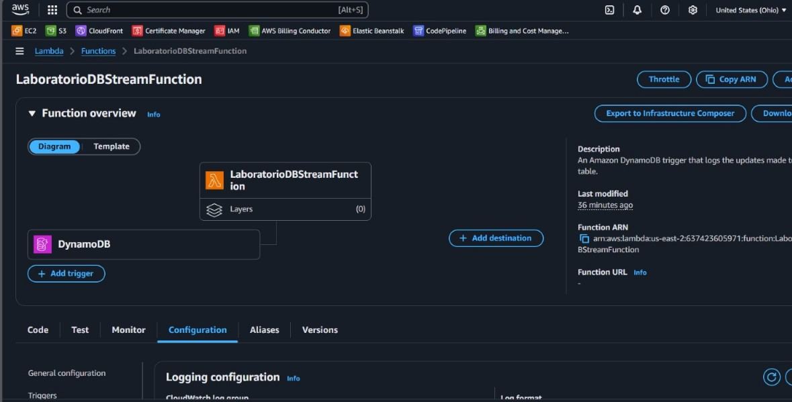
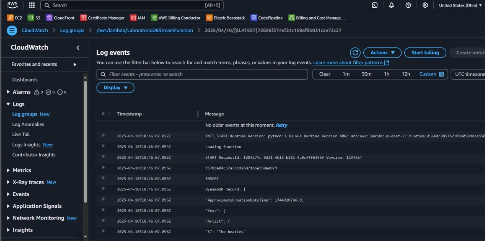

# DynamoDB Stream Lambda Integration

This project documents a hands-on practice using **Amazon DynamoDB** with **AWS Lambda** and **CloudWatch Logs**. The goal was to create a DynamoDB table, insert data with TTL (Time to Live), link a Lambda function via a DynamoDB stream, and monitor the events using CloudWatch.

---

## Objective

The objective of this lab is to practice event-driven architecture using DynamoDB Streams and AWS Lambda, with the following goals:

- Create a DynamoDB table with TTL enabled.
- Insert, read, update, and query items in the table.
- Create a Lambda function triggered by changes in the DynamoDB table.
- Monitor the function's activity using Amazon CloudWatch.

---

## Table of Contents

- [Architecture](#architecture)
- [Cost](#cost)
- [Deployment](#deployment)
- [Monitoring](#monitoring)
- [Security](#security)
- [Learn More](#learn-more)

---

## Architecture

The architecture consists of the following AWS components:

- **DynamoDB Table**: With TTL and partition/sort keys.
- **Lambda Function**: Triggered by DynamoDB Stream.
- **CloudWatch Logs**: To monitor Lambda invocations.

---

## Cost

This lab uses free-tier eligible resources where possible. Estimated cost:

### 1. **DynamoDB**

- Free tier: 25 GB storage and 200M requests/month

### 2. **Lambda**

- 1M free invocations/month

### 3. **CloudWatch Logs**

- ~Free for low-volume logs

**Estimated Total**: $0.00–$0.10 for short usage

---

## Deployment

### 1. **Create DynamoDB Table**

The first step was to create a DynamoDB table named `Music`. This table was designed to store music metadata. We defined:

- **Partition key**: `Artist` — uniquely identifies a musical artist.
- **Sort key**: `SongTitle` — uniquely identifies a song under the artist.

We also enabled **Time to Live (TTL)** functionality to automatically delete items after a specified time. The TTL attribute used was `Expiration`, and a UNIX timestamp was assigned to each item during insertion.

Provisioned throughput was set to on-demand mode to avoid managing read/write capacity manually.

---

### 2. **Insert, Read, Update, and Query Data**

Once the table was created, the next step involved interacting with the data. This included several CRUD operations:

- **Insert Data**: Added several entries to the `Music` table. Each item had the fields: `Artist`, `SongTitle`, `AlbumTitle`, `Year`, and `Expiration`.

  - Example: `{ "Artist": "Acme Band", "SongTitle": "Happy Day", "AlbumTitle": "Songs About Life", "Year": 2012, "Expiration": 1744317600 }`

- **Read Data**: Retrieved items by specifying both partition key (`Artist`) and sort key (`SongTitle`) using the console or CLI. This demonstrated point-read capability.

- **Update Data**: Modified an existing item by changing the `AlbumTitle` while keeping `Artist` and `SongTitle` fixed. This simulated real-world use cases like updating metadata.

- **Query Data**: Queried all songs by a specific artist using only the `Artist` key. This operation returns multiple items, demonstrating use of a partition key query pattern.

These steps were crucial to validate table structure and ensure data consistency.

---

### 3. **Configure AWS Lambda Triggered by DynamoDB Stream**

A Lambda function named `LaboratorioDBStreamFunction` was created using the AWS Console. The function was written in Python and configured to trigger whenever new data was inserted or modified in the `Music` table via **DynamoDB Streams**.

The steps included:

- Enabling Streams on the `Music` table with `New and old images` option.
- Granting Lambda permissions to access DynamoDB Streams and write to CloudWatch.
- Associating the table’s stream with the Lambda function as a trigger.
- Writing the function handler to parse the stream event and log changes (e.g., detect new songs or updates).

This setup enables near real-time processing of changes in the database.

---

### 4. **Review Logs in CloudWatch**

After deploying and testing the Lambda trigger, we validated everything by checking **Amazon CloudWatch Logs**. The process included:

- Navigating to the log group for the Lambda function.
- Inspecting log streams to confirm Lambda execution.
- Reviewing messages to verify that inserted or updated items were captured and processed correctly.

Each invocation produced a log showing the event payload, proving that the trigger was firing correctly on changes in the DynamoDB table.

## Monitoring

- **CloudWatch Logs**: Used to monitor and debug Lambda executions triggered by the DynamoDB Stream.
- Log entries confirmed proper data flow and TTL-based deletions.

---

## Security

- **IAM Role**: Lambda had permissions to read from DynamoDB Streams and write to CloudWatch.
- **Minimal Access**: Only necessary permissions granted.

---

## Learn More

- [Amazon DynamoDB](https://docs.aws.amazon.com/amazondynamodb/latest/developerguide/getting-started-NextSteps.html)
- [AWS Lambda](https://docs.aws.amazon.com/lambda/)
- [Amazon CloudWatch](https://docs.aws.amazon.com/cloudwatch/)
- [DynamoDB Streams](https://docs.aws.amazon.com/amazondynamodb/latest/developerguide/Streams.html)
