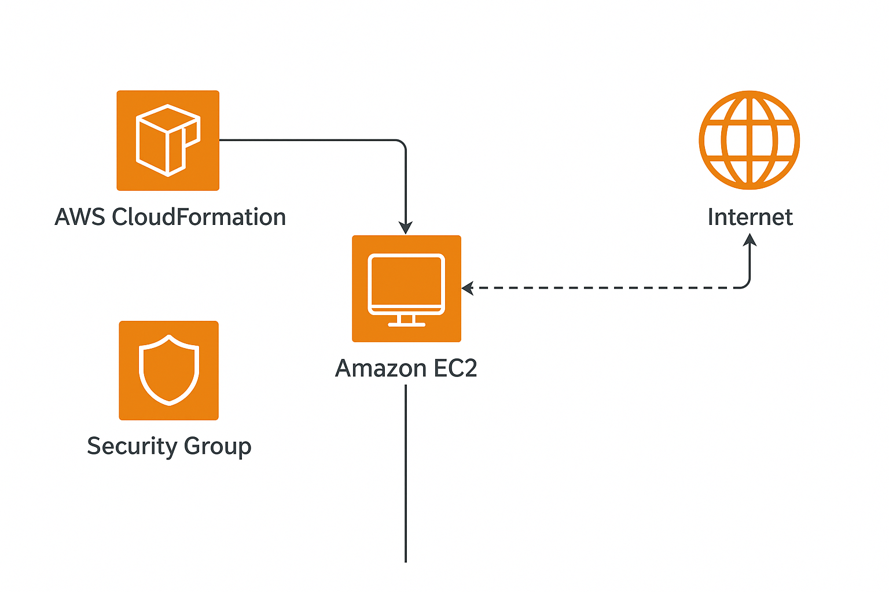

# EC2 Instance Creation via CloudFormation Template

This project demonstrates the deployment of an Amazon EC2 instance using **AWS CloudFormation** with Infrastructure Composer. It includes defining resources as code (IaC), launching an instance, installing a web server, and validating access to a hosted webpage.

---

### Objective

The goal of this practice is to deploy a basic EC2 instance using a CloudFormation YAML template. It automates the provisioning of compute resources and basic network configuration.

---

## Table of Contents

- [Architecture](#architecture)
- [Cost](#cost)
- [Deployment](#deployment)
- [Monitoring](#monitoring)
- [Security](#security)
- [Learn More](#learn-more)

---

## Architecture

This practice includes:

- **EC2 Instance** with Amazon Linux 2
- **Security Group** to allow HTTP traffic (port 80)
- All resources created via **CloudFormation** using **Infrastructure Composer**

---

## Cost

This practice was executed using **Free Tier eligible resources**:

- **Instance type**: t2.micro
- **Region**: us-east-1

### Estimated Real Cost (If Not in Free Tier)

**Instance**: ~$0.0116/hour → ~$8.35/month  
**Storage**: 8 GB EBS → ~$0.92/month  
**Total Estimate**: ~$9.27/month

---

## Deployment

The deployment was performed using AWS CloudFormation and the Infrastructure Composer interface. Here are the steps:

1. **CloudFormation Template Definition**  
   A new CloudFormation YAML template was written that defines the EC2 instance, its security group, and startup commands. This was done using Infrastructure Composer’s template editor.

   
   

2. **Resource Architecture in Composer**  
   Using the canvas view of Infrastructure Composer, the EC2 instance and security group were visually connected to understand the relationship between resources.

   

3. **Template Deployment via CloudFormation**  
   The CloudFormation stack was launched using the defined template, provisioning the EC2 instance automatically with all configurations in place.

   

4. **Instance Confirmation in EC2 Console**  
   Once the stack was deployed, the instance appeared in the EC2 console, confirming that the CloudFormation template executed successfully.

   

5. **Web Server Validation**  
   The instance’s public IP was accessed from a web browser to confirm that the Apache web server was installed and serving the default web page.

   

---

## Monitoring

Basic instance status checks were monitored through the EC2 console:

- **Status Checks**: Ensure instance is healthy
- **Logs**: User data script success can be verified in system logs (via EC2 -> Actions -> Instance Settings -> Get System Log)

---

## Security

The security group included in the template allowed:

- **Inbound Rules**:

  - Port 22 (SSH) — limited to personal IP
  - Port 80 (HTTP) — open to the internet (0.0.0.0/0)

- **Outbound Rules**: All traffic allowed by default

---

## Learn More

- [Amazon EC2 Documentation](https://docs.aws.amazon.com/ec2/)
- [CloudFormation Documentation](https://docs.aws.amazon.com/cloudformation/)
- [User Data Scripts](https://docs.aws.amazon.com/AWSEC2/latest/UserGuide/user-data.html)
