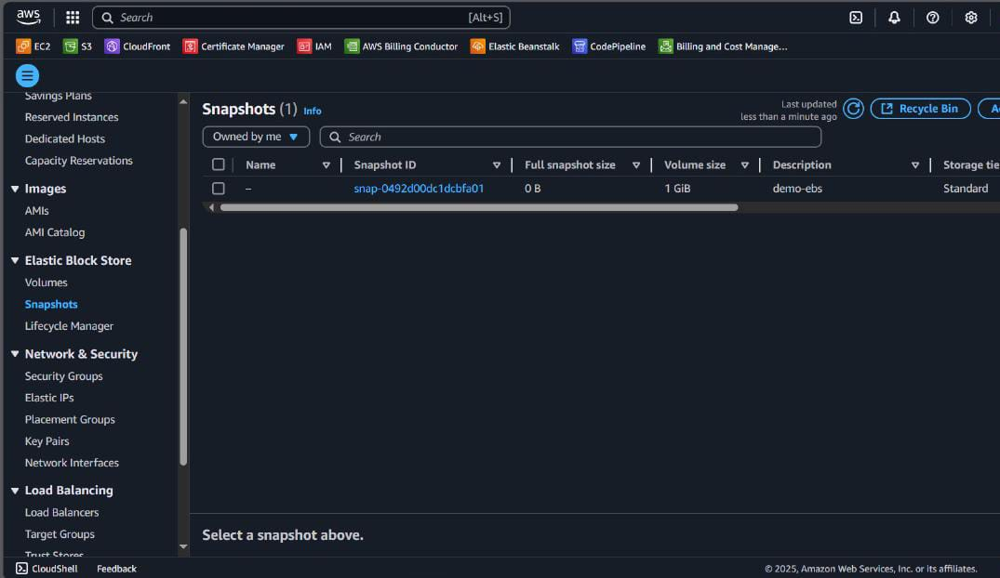

# Web Server with EC2 and Persistent Storage using EBS Snapshots

This project uses Amazon EC2 and Amazon EBS to create a web server instance and generate snapshots of its volumes. The goal is to allow the instance to be safely terminated when not in use, reducing costs without losing stored data.

### Objective

Allow an EC2 instance to be safely terminated in order to save costs, while preserving the data in EBS volume snapshots and being able to restore it at any time.

---

## Table of Contents

- [Architecture](#architecture)
- [Cost](#cost)
- [Deployment](#deployment)
- [Monitoring](#monitoring)
- [Security](#security)
- [Learn More](#learn-more)

---

## Architecture

The architecture of the project includes the following components:

- **EC2 Instance (Amazon Linux)**: Hosts the Apache web server.
- **EBS Volumes (Elastic Block Store)**: Provide persistent storage for the system and user data.
- **EBS Snapshots**: Store the state of the volumes at a specific point in time for future restoration.

---

## Cost

The project utilizing an **EC2 instance** with **EBS volumes** and **EBS snapshots** has been estimated for **one single day of usage**, with the resources described below. Below are the calculated costs:

### 1. **EC2 Instance (t3.micro)**

- **Cost per hour**: **$0.0104 USD** (for t3.micro)
- **Total cost for 1 day (24 hours)**:  
  0.0104 USD \* 24 = 0.2496 USD

### 2. **EBS Volume (8 GB General Purpose SSD)**

- **Cost per GB per month**: **$0.10 USD**
- **Total cost for 8 GB for 1 day**:  
  0.10 USD / 30 days = 0.00333 USD per day
- **Total cost for 8 GB for 1 day**:  
  0.00333 USD

### 3. **EBS Snapshot (8 GB)**

- **Cost per GB per month**: **$0.05 USD**
- **Total cost for 8 GB for 1 day**:  
  0.05 USD / 30 days = 0.00167 USD per day
- **Total cost for 8 GB for 1 day**:  
  0.00167 USD

### 4. **Custom AMI (8 GB)**

- **Cost per GB per month**: **$0.023 USD**
- **Total cost for 8 GB for 1 day**:  
  0.023 USD / 30 days = 0.00077 USD per day
- **Total cost for 8 GB for 1 day**:  
  0.00077 USD

### **Total Estimated Cost for 1 Day Usage**

- **EC2 Instance (t3.micro)**: 0.2496 USD
- **EBS Volume (8 GB)**: 0.00333 USD
- **EBS Snapshot (8 GB)**: 0.00167 USD
- **Custom AMI (8 GB)**: 0.00077 USD

**Total cost for 1 day**:  
0.2496 + 0.00333 + 0.00167 + 0.00077 = 0.25537 USD

### **Summary**

The total estimated cost for using the EC2 instance with EBS and Snapshot services for **one day** is **approximately 0.25537 USD**.

---

## Deployment

The project was deployed using an EC2 instance optimized with EBS volumes, minimizing costs through the creation of EBS volume snapshots. Below are the steps followed to configure the resources in AWS.

1. **EC2 Instance Creation**  
   A new EC2 instance was launched using **Amazon Linux 2023**. During setup, a user data script was used to install Apache (`httpd`), start the service, and generate a sample `index.html` file displaying a custom message.

   
   
   

2. **EBS Volume Configuration and Attachment**  
   After launching the instance, additional EBS volumes were created and attached for persistent storage. These volumes were configured to ensure that important data or persistent configuration were kept separate from the EC2 instance lifecycle, helping reduce costs.

   

3. **SSH Connectivity and Service Verification**  
   After launching the instance, SSH connectivity was validated and it was verified that the Apache server was running correctly. The content served by the server was accessible via a web browser and responded as expected.

4. **Creating an EBS Snapshot**  
   To reduce costs and ensure data availability, a snapshot was created from the EBS volume where important data and persistent configuration were stored. This allowed the current state of the instance to be preserved for future restoration.

   

5. **Restoring the Instance from Snapshot**  
   When the instance was needed again, a new volume could be created from the snapshot and attached to a new EC2 instance. This enabled the restoration of the configuration and data exactly as it was in the original instance, with no data loss.

   

6. **Recovery Validation**  
   After launching a new instance with the volume restored from the snapshot or using the custom AMI, it was verified that the Apache service, files, and configuration were working properly, just like in the original instance.

   

---

## Monitoring

To ensure the proper functioning and security of the project, monitoring tools were implemented using **CloudWatch**:

1. **AWS CloudWatch**
   **CloudWatch logs** were configured to capture events generated by the Lambda function during its execution. This allows real-time monitoring of the Lambda's behavior, detecting potential errors and performance issues, and ensuring that transformations are performed correctly.

---

## Security

The following security measures were implemented to protect the environment deployed in AWS:

- **Security Groups**

  - A security group was configured to allow HTTP access (port 80) from any IP address, ensuring public availability of the hosted website.

- **Key Pair**
  - An SSH key pair was used for authentication. The private key (`.pem`) was securely stored and used exclusively for administrative access to the EC2 instance.

---

## Learn More

Explore the tools and technologies used in this project:

- [Amazon EC2 Documentation](https://docs.aws.amazon.com/ec2/)
- [Amazon EBS Documentation](https://docs.aws.amazon.com/ebs/)
