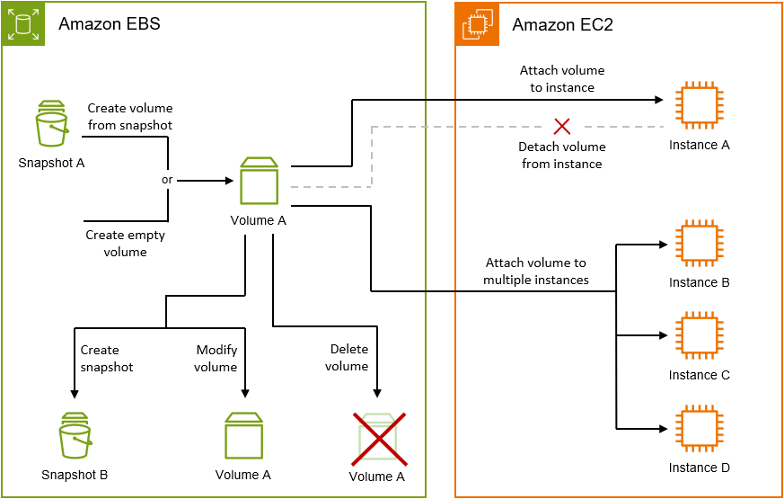

## Architecture

The architecture of the project includes the following components:

- **EC2 Instance (Amazon Linux)**: Hosts the Apache web server.
- **EBS Volumes (Elastic Block Store)**: Provide persistent storage for the system and user data.
- **EBS Snapshots**: Store the state of the volumes at a specific point in time for future restoration.

