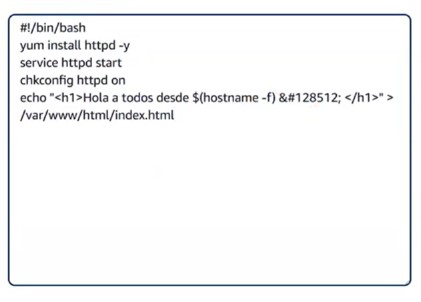
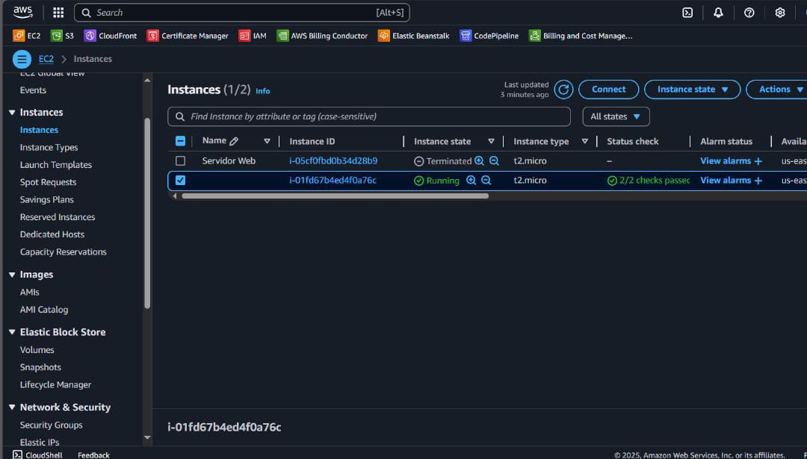
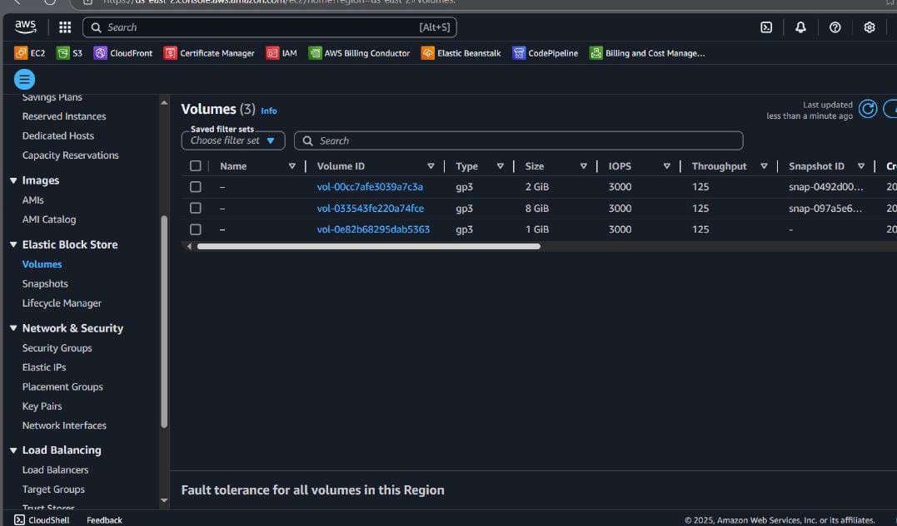
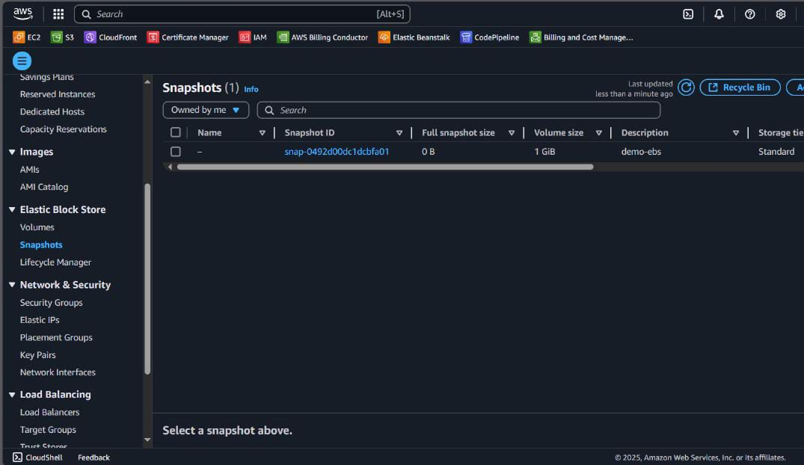
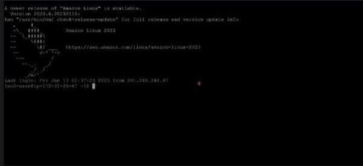

## Deployment

The project was deployed using an EC2 instance optimized with EBS volumes, minimizing costs through the creation of EBS volume snapshots. Below are the steps followed to configure the resources in AWS.

1. **EC2 Instance Creation**  
   A new EC2 instance was launched using **Amazon Linux 2023**. During setup, a user data script was used to install Apache (`httpd`), start the service, and generate a sample `index.html` file displaying a custom message.

   
   
   

2. **EBS Volume Configuration and Attachment**  
   After launching the instance, additional EBS volumes were created and attached for persistent storage. These volumes were configured to ensure that important data or persistent configuration were kept separate from the EC2 instance lifecycle, helping reduce costs.

   

3. **SSH Connectivity and Service Verification**  
   After launching the instance, SSH connectivity was validated and it was verified that the Apache server was running correctly. The content served by the server was accessible via a web browser and responded as expected.

4. **Creating an EBS Snapshot**  
   To reduce costs and ensure data availability, a snapshot was created from the EBS volume where important data and persistent configuration were stored. This allowed the current state of the instance to be preserved for future restoration.

   

5. **Restoring the Instance from Snapshot**  
   When the instance was needed again, a new volume could be created from the snapshot and attached to a new EC2 instance. This enabled the restoration of the configuration and data exactly as it was in the original instance, with no data loss.

   

6. **Recovery Validation**  
   After launching a new instance with the volume restored from the snapshot or using the custom AMI, it was verified that the Apache service, files, and configuration were working properly, just like in the original instance.

   
