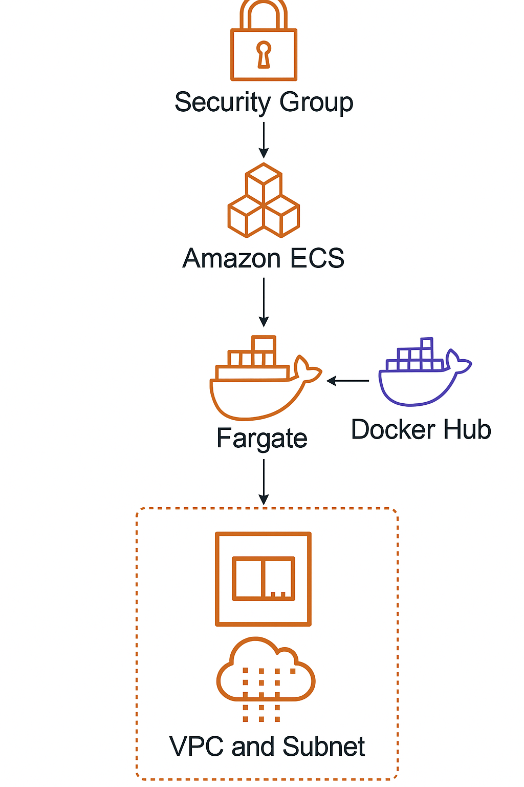
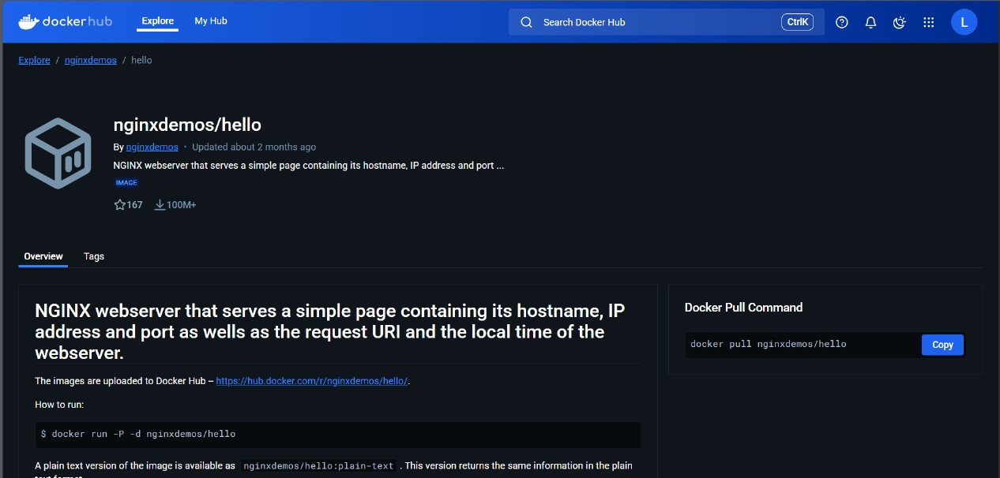
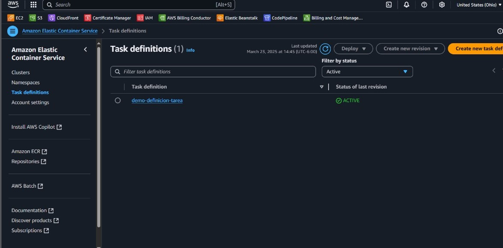

# Deploying a Container with Amazon ECS Fargate

This project demonstrates how to deploy a Docker container on **Amazon Elastic Container Service (ECS)** using the **Fargate** launch type. The container image used in this project is `nginxdemos/hello`, a simple NGINX webserver that returns its IP, port, and request information.

### Objective

The objective of this project is to demonstrate how to deploy a public Docker image to AWS using ECS and Fargate, covering all key steps including the creation of a cluster, task definition, and task deployment, as well as tracking infrastructure provisioning via AWS CloudFormation.

---

## Table of Contents

- [Architecture](#architecture)
- [Cost](#cost)
- [Deployment](#deployment)
- [Monitoring](#monitoring)
- [Security](#security)
- [Learn More](#learn-more)

---

## Architecture

The architecture of this project includes the following AWS components:

- **Amazon ECS**: Used to orchestrate and manage containers.
- **Fargate**: Provides serverless compute engine to run containers.
- **Docker Hub**: Public image registry used to pull the `nginxdemos/hello` container.
- **VPC and Subnets**: Used for networking of ECS tasks.
- **IAM Role**: Grants permissions needed for ECS tasks.
- **Security Group**: Configured to allow HTTP access to the container.



---

## Cost

This project incurs minimal cost since only one ECS task is run using Fargate for a short period.

### 1. **ECS Fargate Task**

- 0.25 vCPU, 0.5 GB RAM for a few hours.
- Estimated cost: **~$0.02 - $0.10 USD** depending on region.

### 2. **Data Transfer**

- Minimal HTTP access only.
- Estimated cost: **~$0.01 USD**.

**Total Estimated Cost**: ~**$0.03 - $0.11 USD**

---

## Deployment

### 1. **Create ECS Cluster**

A new ECS cluster was created via the AWS Management Console:

- **Cluster Template**: "Networking only" (Fargate)
- **Cluster Name**: `demo-cluster`
- **VPC**: An existing VPC with public subnets was selected to enable internet access.
- **Subnets**: Two public subnets were selected for task deployment redundancy.
- **Container Insights**: Optional, but not enabled for this basic deployment.

> ECS automatically created supporting infrastructure such as a CloudFormation stack, which provisions the necessary networking and IAM resources.

### 2. **Select Docker Image from Docker Hub**

The public image `nginxdemos/hello` was chosen:



- This container runs an NGINX server that returns its IP address, hostname, and request data.

### 3. **Create Task Definition**

A task definition was created specifying how the container should run:

- **Family**: `demo-definition`
- **Launch type compatibility**: Fargate
- **Network mode**: `awsvpc` (required for Fargate)
- **Container Definitions**:
  - **Name**: `nginx-demo`
  - **Image**: `nginxdemos/hello`
  - **Memory**: `512` MiB
  - **CPU**: `256` units
  - **Port Mappings**: Expose port `80/tcp`
  - **Log configuration**: Not configured in this demo



- **Task Execution Role**: Automatically created by ECS (`ecsTaskExecutionRole`) with permissions to pull images and write logs.

### 4. **Run Task as a Service**

Using the created task definition, a service was deployed to the ECS cluster:

- **Launch Type**: Fargate
- **Number of Tasks**: 1
- **Public IP**: Enabled (assigns an elastic IP)
- **Security Group**: A new security group was created allowing HTTP (port 80)
- **Subnets**: Public subnets selected

The service pulls the image from Docker Hub and deploys it to a Fargate-managed compute resource.

### 5. **Access Web Page**

After deployment, the task’s public IP address was accessed in a browser:

```
http://<public-ip>
```

A page displaying hostname, IP, port, request URI, and server time confirms successful deployment.

---

## Monitoring

- **ECS Console**: Monitored task status and service health.
- **CloudWatch Logs**: Not configured, but can be added for detailed logs.
- **CloudFormation Console**: Automatically reflected all resources created through ECS wizard.
  - Includes service, task role, log group (if enabled), and networking resources.
  - Helpful for troubleshooting or replicating infrastructure as code.

---

## Security

Security configurations implemented:

- **Security Group**: Allows inbound HTTP traffic (port 80) from all IPs.
- **IAM Role (`ecsTaskExecutionRole`)**: Grants permission to download the Docker image and communicate with AWS services.
- **VPC and Subnets**: Used for isolation and connectivity.

---

## Learn More

- [Amazon ECS Documentation](https://docs.aws.amazon.com/ecs/)
- [AWS Fargate Documentation](https://docs.aws.amazon.com/fargate/)
- [Docker Hub: nginxdemos/hello](https://hub.docker.com/r/nginxdemos/hello)
- [AWS IAM Roles](https://docs.aws.amazon.com/IAM/)
- [AWS CloudFormation](https://docs.aws.amazon.com/cloudformation/)
