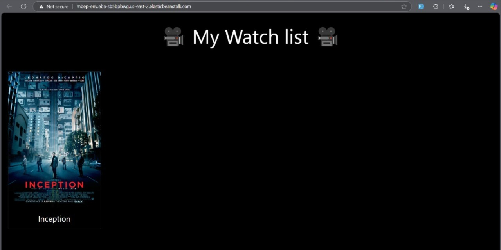

# CI/CD Deployment using AWS Elastic Beanstalk and CodePipeline

This project demonstrates how to deploy a Node.js application using AWS Elastic Beanstalk integrated with CodePipeline for CI/CD. The process involves setting up a Beanstalk environment, storing artifacts in S3, and automating the deployment through a pipeline.

---

## Objective

The objective of this project is to show how to configure and deploy a web application using AWS Elastic Beanstalk along with CodePipeline. This CI/CD pipeline allows automated deployment whenever new versions of the application are pushed to the source repository.

---

## Table of Contents

- [Architecture](#architecture)
- [Cost](#cost)
- [Deployment](#deployment)
- [Monitoring](#monitoring)
- [Security](#security)
- [Learn More](#learn-more)

---

## Architecture

The architecture consists of the following components:

- **Elastic Beanstalk**: Hosts and manages the application.
- **Amazon S3**: Stores application artifacts (ZIP files).
- **AWS CodePipeline**: Automates the deployment from source to Beanstalk.

---

## Deployment

### 1. Create the Application in Elastic Beanstalk

- Go to **AWS Elastic Beanstalk** in the AWS Management Console.
- Click **Create Application**.
- Provide a name for the application (e.g., `MyApp`).
- Choose a platform (e.g., Node.js, Python).
- Optionally upload your application code or use the sample application.

> 

### 2. Create an Environment Within the Application

- Click **Create Environment** under the application.
- Select **Web server environment**.
- Choose platform and upload application code if not already done.
- Click **Create environment**.

> 

### 3. Wait for Automatic Deployment and Review Environment Events

- Wait while the environment is launched and your app is deployed.
- Monitor the **Events** tab for updates and deployment progress.

> 

### 4. Register the CNAME of the Instance

- Go to the **Environment Overview**.
- Copy the default **CNAME** assigned to your environment.
- Register or map the CNAME in your DNS settings if needed.

> 

### 5. Verify Environment Health and Application Status

- Ensure the environment shows **Health: Green**.
- Check logs and monitoring if needed to confirm the application is healthy.

> 

### 6. Open the Application Using the CNAME

- Open a browser and paste the copied **CNAME URL**.
- Confirm that the deployed application loads and works correctly.
- You can see the before-and-after.

Before

> 

After

> 

### 7. Review or Create the S3 Bucket for Artifacts

- Go to **Amazon S3** and ensure a bucket is available.
- This bucket will be used to store deployment artifacts.

> 

### 8. Create a Pipeline in AWS CodePipeline

- Navigate to **AWS CodePipeline**.
- Click **Create pipeline**.
- Enter a name for the pipeline and select a service role.

> 

### 9. Configure Pipeline Properties

- Define the **pipeline name**, **artifact store**, and **IAM roles**.
- Choose the source provider (e.g., GitHub, S3).
- Configure the deployment provider (e.g., Elastic Beanstalk).

> 

### 10. View the Graphical Representation of the Pipeline

- After creation, you can visualize the flow:
  - **Source Stage**: fetches the application code.
  - **Deploy Stage**: deploys to Elastic Beanstalk.
- Monitor the status of each stage in real-time.

> 

---

## Cost

This setup is free within AWS Free Tier limits, but under regular usage, costs are incurred as follows:

### 1. **Elastic Beanstalk (EC2, Load Balancer, etc.)**

- Based on instance types (e.g., t2.micro)
- **Estimated Cost**: ~$0.0116/hour per instance

### 2. **S3 Storage**

- ~$0.023 per GB stored per month

### 3. **CodePipeline**

- First pipeline is free
- Each additional pipeline: $1.00/month

### 4. **Data Transfer**

- Free up to 1GB out per month (AWS Free Tier)

> **Total Estimated Cost (basic deployment)**: ~$10–15/month if Free Tier is exceeded

---

## Monitoring

### 1. **Elastic Beanstalk Console**

- Shows real-time environment health and logs

### 2. **CloudWatch Logs**

- All deployed environments and pipelines can be monitored through AWS CloudWatch, which allows log tracking, metrics visualization, and alert configuration.

---

## Security

1. **IAM Roles**: IAM roles are assigned to CodePipeline and Elastic Beanstalk environments to allow specific access to S3, CodeDeploy, and logging.
2. **S3 Bucket Policies**: S3 buckets storing application artifacts have restricted access policies applied.
3. **Pipeline Permissions**: Pipeline execution roles have limited and scoped permissions following least-privilege principles.

---

## Learn More

Explore the tools and services used in this project:

- [AWS Elastic Beanstalk](https://docs.aws.amazon.com/elasticbeanstalk/)
- [AWS CodePipeline](https://docs.aws.amazon.com/codepipeline/)
- [Amazon S3](https://docs.aws.amazon.com/s3/)
