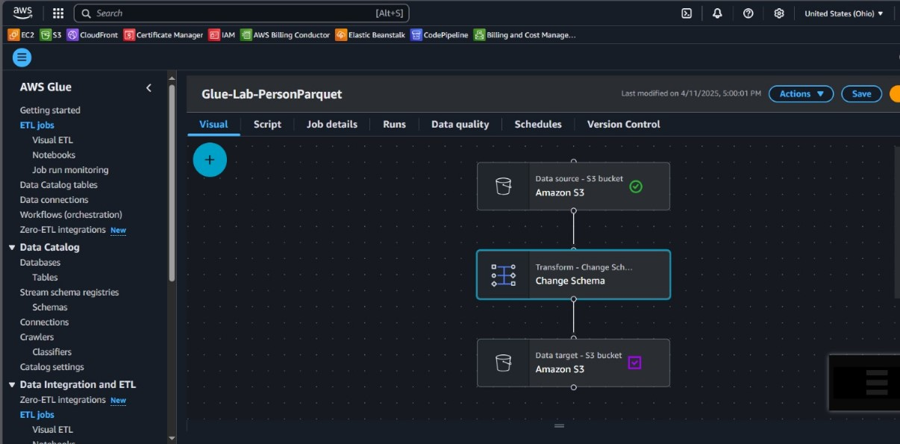

# Data Transformation with AWS Glue Studio

This project documents the process of transforming CSV data into Parquet format using AWS Glue Studio. The data transformation was performed on datasets stored in Amazon S3, utilizing Glue Crawlers to catalog the data and Glue Jobs for the ETL (Extract, Transform, Load) process.

## Objective

The objective of this project was to transform CSV data stored in Amazon S3 into Parquet format using AWS Glue Studio. This allowed optimization of storage and improved query performance when analyzed with other AWS services.

---

## Table of Contents

- [Architecture](#architecture)
- [Cost](#cost)
- [Deployment](#deployment)
- [Monitoring](#monitoring)
- [Security](#security)
- [Learn More](#learn-more)

---

## Architecture

The architecture used in this project consisted of the following AWS services:

- **Amazon S3**: Storage of CSV and Parquet files.
- **AWS Glue Crawlers**: Automatic detection of schemas from data stored in S3.
- **AWS Glue Studio**: Visual creation of ETL Jobs for data transformation.
- **AWS Glue Data Catalog**: Centralized metadata repository.
- **Amazon Athena**: Used to query the resulting datasets.

---

## Cost

The cost of this project was minimal since only **one-time execution** was performed for practice purposes. Below is the estimated cost:

### 1. **Glue Crawlers**

- **Cost per Crawler run**: $0.44 per DPU-hour
- **Estimated usage**: Less than 0.1 DPU-hour

### 2. **Glue Jobs**

- **Cost per Job run**: $0.44 per DPU-hour
- **Estimated usage**: ~1 DPU-hour for the transformation

### 3. **Amazon S3**

- **Storage**: Negligible for small datasets used in practice.

### 4. **Athena Queries**

- **Cost per query**: $5 per TB scanned
- **Data scanned**: Very small, resulting in negligible cost

### **Total estimated cost**: Less than **$1 USD** for the entire exercise.

---

## Deployment

The deployment of this practice involved the following detailed steps:

### 1. Create Databases in Glue

To begin, a new database named `ticketdata` was created within the AWS Glue Data Catalog. This database served as the primary location for organizing all metadata associated with the datasets. The creation of this database provided a structured environment in which the results of the Glue Crawlers could be stored and subsequently referenced by ETL Jobs. This setup facilitated easier data management throughout the practice.

### 2. Create a Crawler

A Crawler was configured to perform the initial full scan of the S3 bucket containing the raw CSV files. The crawler was named `glue-lab-crawler` and was pointed to the S3 path holding the dataset (e.g., `s3://xxx-dmslabs3bucket-xxx/tickets/`). The configuration also specified the IAM role `xxx-GlueLabRole-xxx` to grant the crawler necessary access permissions. This process ensured that the raw data stored in S3 could be cataloged automatically by AWS Glue.

### 3. Run Crawlers

After the crawler was created, it was executed to perform its scan on the designated S3 bucket. The crawler ran through all objects within the provided path and extracted schema information from each file. This execution allowed AWS Glue to map the CSV files into structured tables within the Data Catalog. The crawler’s status was monitored until it successfully completed the scan.

### 4. View Crawlers

Once the crawler completed its execution, its details were reviewed in the AWS Glue Console. By accessing the list of Crawlers in the Glue interface, I was able to confirm that the crawler was in the READY state, indicating it had successfully scanned the datasets. This verification step was essential to confirm the crawler's configuration was correct and functional.

### 5. View Details of a Crawler

The configuration details of the second crawler, which was used later for scanning the transformed Parquet files, were examined. This review included checking the associated database, S3 path configuration (e.g., `s3://xxx-dmslabs3bucket-xxx/tickets/dms_parquet/`), and the assigned IAM role. Verifying these settings helped ensure that the subsequent transformations and crawls would function as expected.

### 6. View Detected Tables

The output of the crawler was reviewed by navigating to the `ticketdata` database and accessing the `Tables` section. Here, I confirmed that the crawler had successfully generated tables corresponding to the different CSV datasets stored in the S3 bucket. This verification process validated that AWS Glue had properly interpreted and cataloged the structure of the raw data.

### 7. View Created Databases

The AWS Glue console was used to confirm that the `ticketdata` database had been successfully created and populated with metadata. By navigating to the `Databases` section within the Data Catalog, the existence of `ticketdata` was visually confirmed, ensuring that subsequent steps would reference the correct database.

### 8. Create Job in Glue Studio

Within Glue Studio, a new ETL job was configured to perform the transformation of the CSV files into Parquet format. The job was assigned the name `Glue-Lab-SportTeamParquet` for the sport_team dataset and was configured to use the correct source table from the `ticketdata` database. The target path for the output Parquet files was specified within the corresponding S3 bucket location.

### 9. Design Job Flow (Visual)

Using Glue Studio’s visual interface, the ETL job flow was designed by linking the data source (S3 bucket), transformation node (Change Schema), and data target (S3 bucket with Parquet format). The visual editor enabled an intuitive setup of the data pipeline, allowing transformations to be specified with clarity, such as adjusting data types or modifying schema attributes.

### 10. Run Jobs

Once the ETL job configuration was complete, it was executed to perform the data transformation. The progress of the job was monitored through the AWS Glue Job run monitoring dashboard, where real-time updates on the execution status were visible. The job typically completed in under a minute, resulting in Parquet files being generated in the specified S3 target location.

### 11. Validate Final Tables

Following the ETL transformations, the newly created Parquet tables were validated by rerunning a separate crawler specifically configured to detect the Parquet format files in the S3 bucket. These tables were then inspected within the Data Catalog to verify that the structure and schema conformed to expectations after transformation.

### 12. Complete Review of Tables

A comprehensive review of all generated tables was performed, including both the initial raw CSV tables and the transformed Parquet tables. This review process ensured that the datasets had been properly cataloged, transformed, and stored, concluding the successful completion of the deployment phase of this practice.

---

## Monitoring

AWS CloudWatch was used to monitor Glue Job execution. Logs were inspected for job duration, errors, and warnings. Monitoring ensured that jobs completed successfully without data loss.

---

## Security

Security best practices were followed:

1. **IAM Roles**: Specific IAM roles were assigned to Glue to allow access to S3 buckets and log into CloudWatch.
2. **S3 Bucket Policies**: S3 policies were adjusted to limit access only to authorized Glue components.
3. **Data Encryption**: S3 data encryption was enabled for stored files.

---

## Learn More

- [AWS Glue Documentation](https://docs.aws.amazon.com/glue/)
- [Amazon S3 Documentation](https://docs.aws.amazon.com/s3/)
- [Amazon Athena Documentation](https://docs.aws.amazon.com/athena/)
- [Lab: Transforming data with Glue](https://catalog.us-east-1.prod.workshops.aws/workshops/976050cc-0606-4b23-b49f-ca7b8ac4b153/en-US/600)
