# Jump Architecture

This project documents the manual setup of a Virtual Private Cloud (VPC) on AWS. The objective was to create a VPC with both public and private subnets, configure route tables, deploy EC2 instances, and test connectivity through a NAT Gateway. The process was executed manually via the AWS Console as part of a hands-on lab.

### Objective

The objective of this lab is to practice deploying a complete VPC architecture with the following goals:

- Create a VPC with public and private subnets across multiple Availability Zones.
- Deploy EC2 instances into each type of subnet.
- Configure routing tables to allow internet access via an Internet Gateway and a NAT Gateway.
- Test connectivity between instances and validate outbound internet access from private instances.

---

## Table of Contents

- [Architecture](#architecture)
- [Cost](#cost)
- [Deployment](#deployment)
- [Monitoring](#monitoring)
- [Security](#security)
- [Learn More](#learn-more)

---

## Architecture

The architecture consists of the following AWS components:

- **VPC**: A Virtual Private Cloud with custom CIDR block.
- **Subnets**: Two public and two private subnets spread across different Availability Zones.
- **Route Tables**: A public route table with Internet Gateway (IGW) and a private one with NAT Gateway.
- **Internet Gateway (IGW)**: For internet access to public subnets.
- **NAT Gateway**: For internet access from private subnets.
- **EC2 Instances**: One in a public subnet and one in a private subnet.

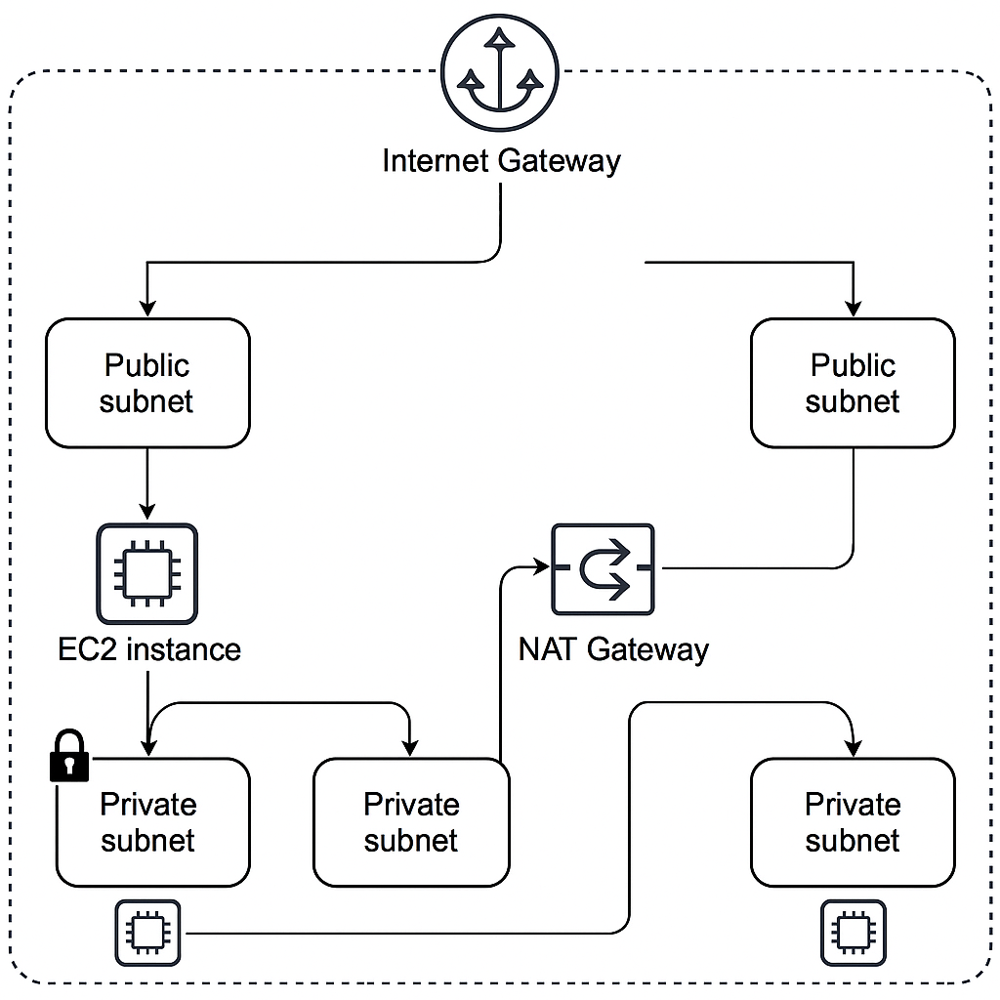

---

## Cost

This lab uses free-tier eligible resources where possible. Estimated cost:

### 1. **EC2 Instances**

- t2.micro (free-tier): $0.00 if under monthly free hours

### 2. **NAT Gateway**

- ~$0.045/hour + data processing charges

### 3. **S3 or EBS (Optional)**

- Minimal usage for logs or storage

**Estimated Total**: ~$0.05–$1.00 for short usage

---

## Deployment

### 1. **VPC Creation**

    The first step was to create a VPC with a custom CIDR block. DNS resolution and hostnames were enabled for the VPC.

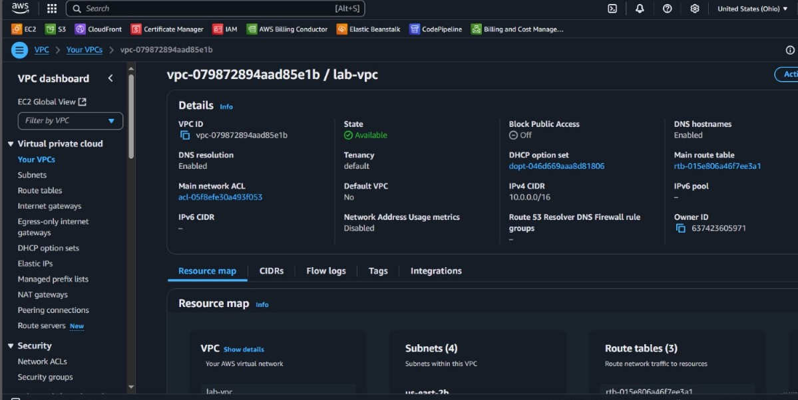

### 2. **Subnets and Route Tables Configuration**

    Four subnets were created: two public and two private. Each pair was distributed across two Availability Zones to ensure high availability. Route tables were created and associated accordingly.

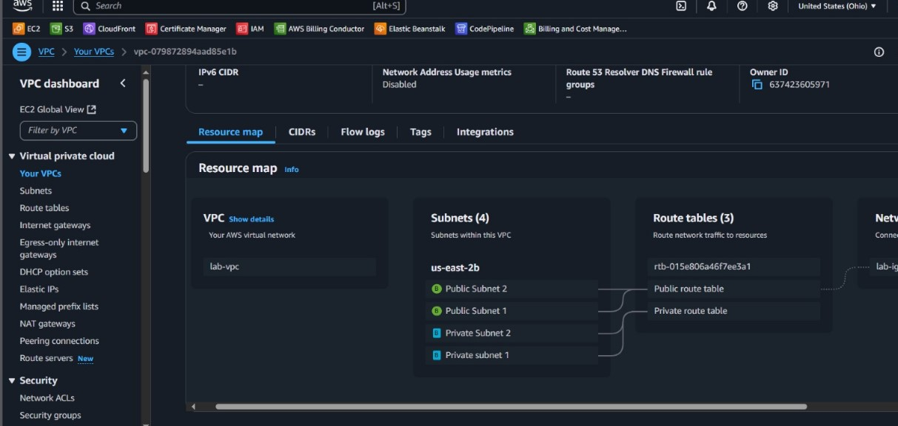

### 3. **C2 Instances Launch**

    Two EC2 instances were launched: one in a public subnet and another in a private subnet. Amazon Linux 2 AMIs were selected for both. The public instance was assigned a public IP address.

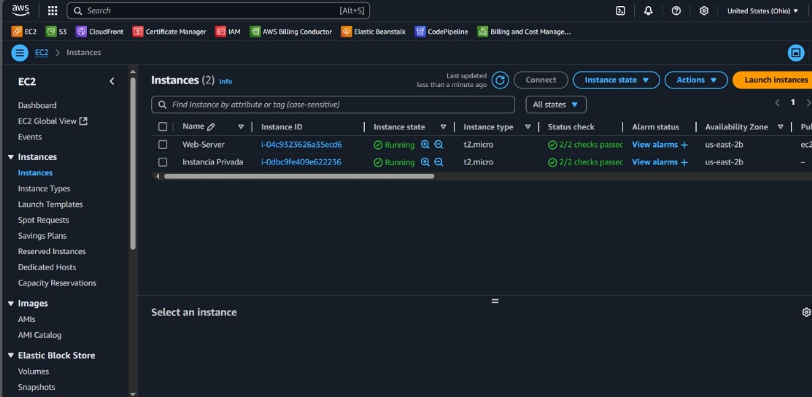

### 4. **Public Route Table with IGW**

    A public route table was created and associated with the public subnets. A route to `0.0.0.0/0` was added pointing to the Internet Gateway.

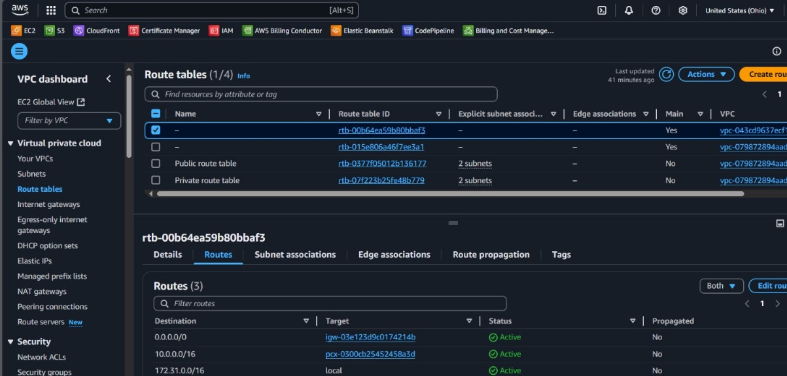

### 5. **Private Route Table with NAT**

    A public route table was created and associated with the public subnets. A route to `0.0.0.0/0` was added pointing to the Internet Gateway.

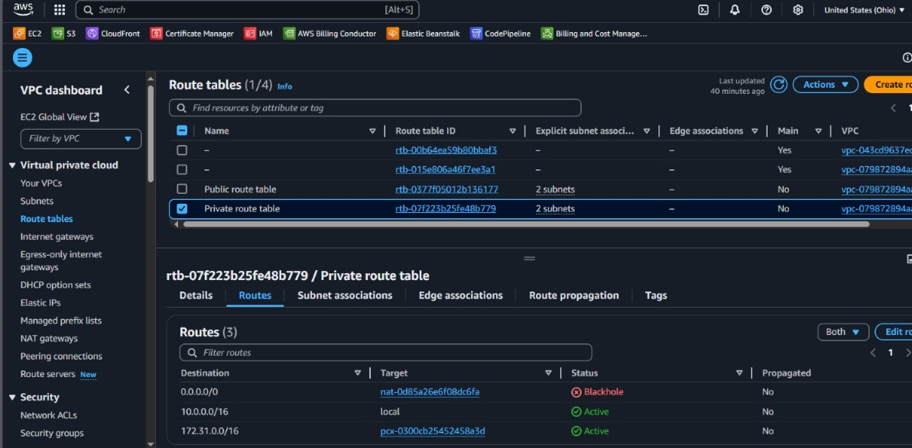

### 6. **NAT Gateway Creation**

    An Elastic IP was allocated and used to create a NAT Gateway in one of the public subnets. The NAT Gateway was then linked to the private route table.

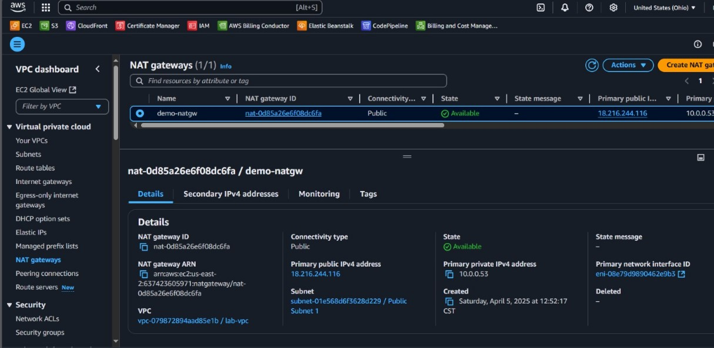

### 7. **SSH Connection to Public Instance**

    Using the key pair generated during EC2 launch, an SSH connection was established from a local terminal to the public instance, verifying external access.

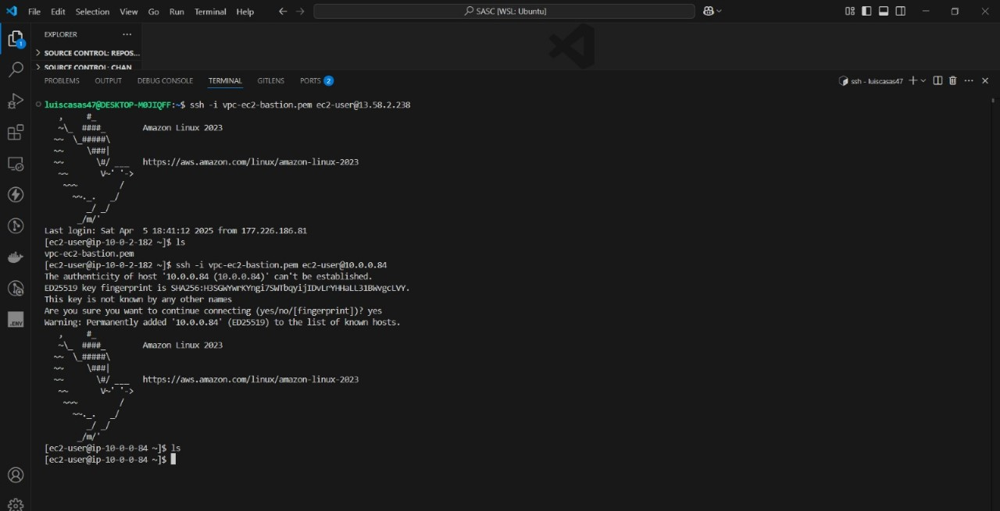

### 8. **Ping to Private Instance**

    From the public EC2 instance, an ICMP echo request (ping) was successfully sent to the private instance, confirming internal VPC connectivity.

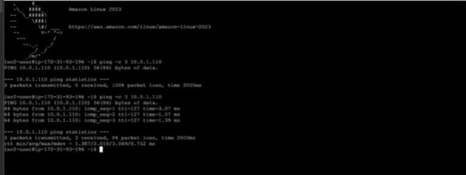

### 9. **yum update Error without NAT**

    An attempt to run `yum update` on the private instance initially failed due to lack of internet access, as the NAT Gateway was not yet properly configured.

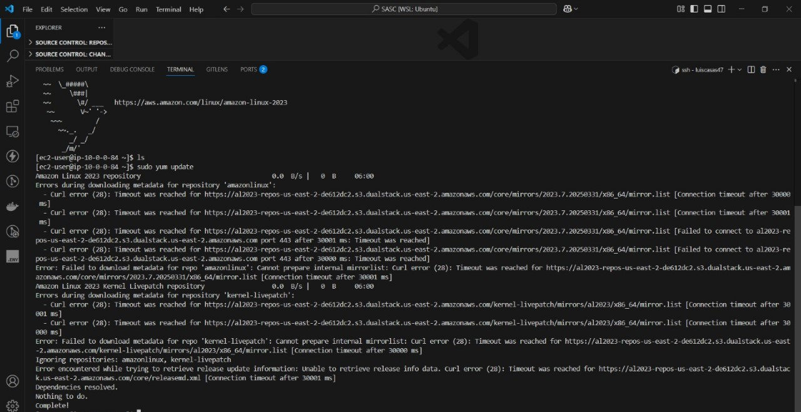

### 10. **yum update Success with NAT**

    After the NAT Gateway and route table were correctly configured, `yum update` was successfully executed on the private instance.

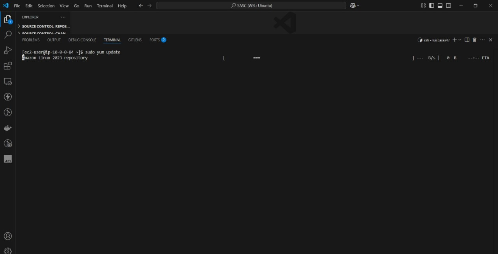

### 11. **EC2 Console Verification**

    The EC2 console was checked to confirm that both instances were running and that the network configuration was as expected.

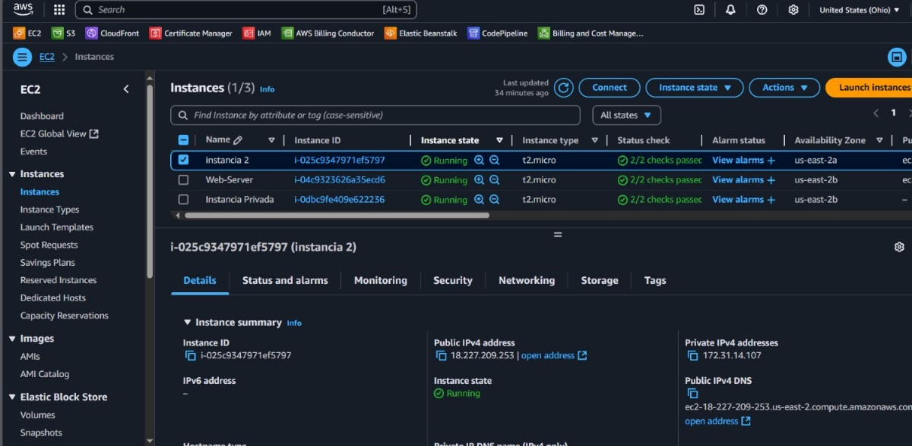

### 12. **Optional VPC Peering**

    As an optional exercise, a VPC peering connection was established between the lab VPC and another VPC. This enabled communication between resources in both VPCs.

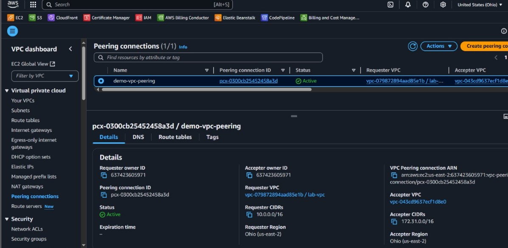

---

## Monitoring

- **CloudWatch**: Logs and metrics were not deeply integrated in this lab, but connectivity tests were performed manually via SSH and ping.
- **EC2 Console**: Used to verify instance state, public/private IPs, and reachability.

---

## Security

- **Security Groups**: Configured to allow SSH access to the public instance and ICMP (ping) traffic between instances.
- **NACLs**: Default Network ACLs were used with no additional custom rules.
- **IAM**: Default roles used; no custom policies were required for this exercise.

---

## Learn More

- [Amazon VPC Documentation](https://docs.aws.amazon.com/vpc/)
- [AWS EC2 Documentation](https://docs.aws.amazon.com/ec2/)
- [AWS NAT Gateway](https://docs.aws.amazon.com/vpc/latest/userguide/vpc-nat-gateway.html)
- [AWS Subnet Routing](https://docs.aws.amazon.com/vpc/latest/userguide/VPC_Route_Tables.html)
