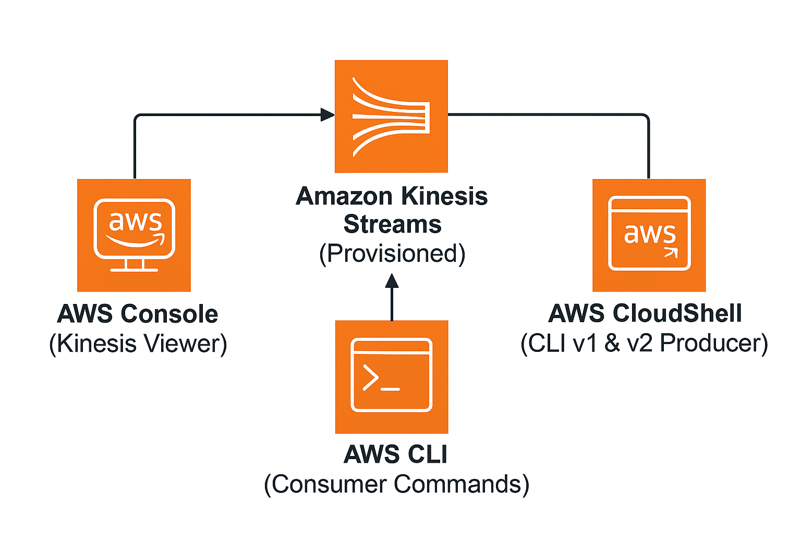
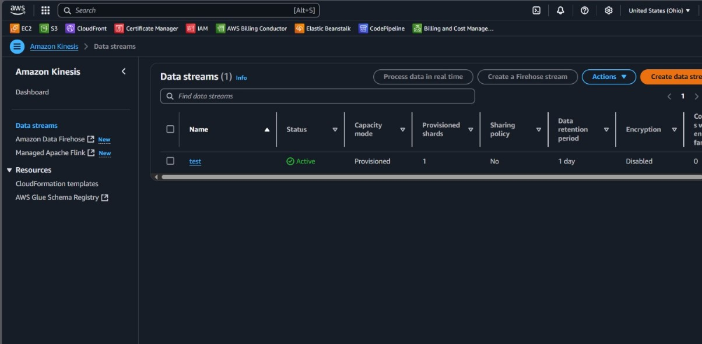
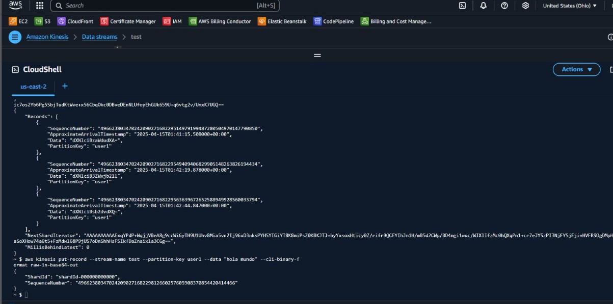
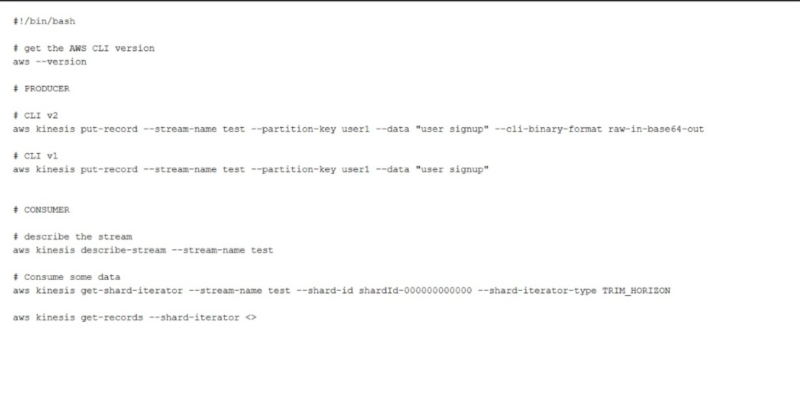
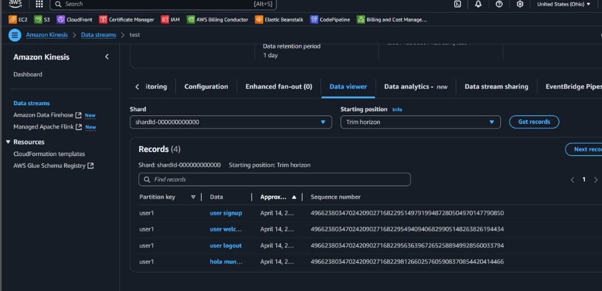
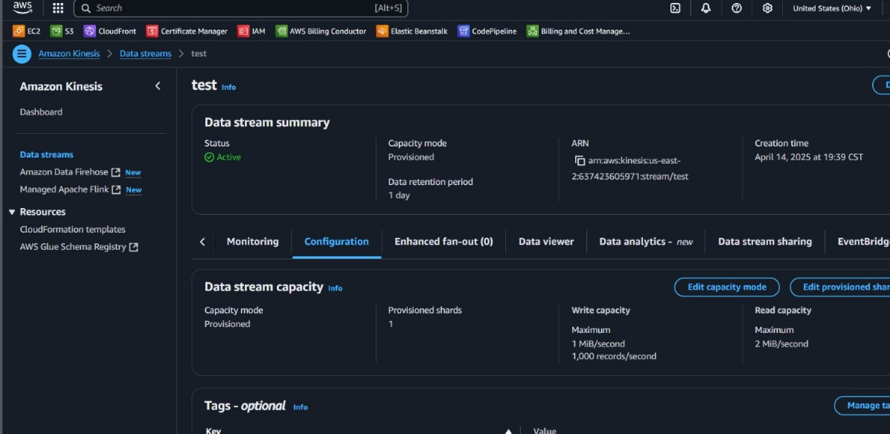

# Amazon Kinesis Data Stream Lab

This project documents a hands-on practice using **Amazon Kinesis Data Streams**. The lab demonstrates how to create a Kinesis stream, ingest data using the AWS CLI (Producer), and consume the records using both the AWS Console and CLI (Consumer).

---

## Objective

The objective of this lab is to understand how to work with Amazon Kinesis for real-time data streaming. The goals included:

- Create and configure a Kinesis data stream.
- Send data to the stream using the AWS CLI.
- Retrieve and inspect the data using both the Kinesis Console and the AWS CLI.

---

## Table of Contents

- [Architecture](#architecture)
- [Cost](#cost)
- [Deployment](#deployment)
- [Monitoring](#monitoring)
- [Security](#security)
- [Learn More](#learn-more)

---

## Architecture

The architecture consists of the following AWS components:

- **Amazon Kinesis Data Stream**: A stream named `test` with provisioned capacity (1 shard).
- **AWS CLI**: Used to insert and retrieve data.
- **Amazon Kinesis Console**: Used to visually inspect the records ingested.



---

## Cost

This lab uses free-tier eligible resources. Estimated cost:

### 1. **Kinesis Data Stream**

- Free tier: 1 MB/sec write throughput (5 PUT records/sec) for 1 shard for the first 12 months.
- 5GB of data retrievals and 5GB of data stored per month.

**Estimated Total**: $0.00 for short-term use under the free tier.

---

## Deployment

### 1. **Create the Kinesis Data Stream**

The first step involved logging into the AWS Console and navigating to the **Amazon Kinesis** service. From there, we created a new data stream named `test`. The following configurations were applied:

- **Capacity mode**: We selected **Provisioned** mode to explicitly define the number of shards.
- **Number of shards**: 1 shard was provisioned.
- **Data retention period**: Set to 1 day by default.
- **Encryption**: Not enabled in this basic test environment.
- **Advanced settings**: We did not use enhanced fan-out or data stream sharing features in this setup.

This setup ensures that the stream can handle up to:

- 1,000 records/second per shard for writes (maximum throughput 1MB/sec)
- 2MB/sec for reads per shard



---

### 2. **Produce Data to the Stream**

We accessed **AWS CloudShell** to use the AWS CLI for putting records into the stream. Data was produced using both CLI v1 and CLI v2 syntax.

We simulated user activity such as **user signup** and **logout**. Example records included:

```bash
# CLI v2 (base64 encoding required)
aws kinesis put-record --stream-name test --partition-key user1 --data "user signup" --cli-binary-format raw-in-base64-out

# CLI v1
aws kinesis put-record --stream-name test --partition-key user1 --data "user signup"
```

This activity represented a typical producer pushing data events (e.g., application logs, analytics events) into the stream in real time.



---

### 3. **Consume Data from the Stream**

To simulate a consumer application, we used AWS CLI to retrieve records from the stream:

1. First, we described the stream to obtain shard information:

```bash
aws kinesis describe-stream --stream-name test
```

2. Then, we obtained a shard iterator to begin consuming data:

```bash
aws kinesis get-shard-iterator --stream-name test --shard-id shardId-000000000000 --shard-iterator-type TRIM_HORIZON
```

3. Finally, we used the iterator to get the records:

```bash
aws kinesis get-records --shard-iterator <iterator>
```

This demonstrated how a consumer reads from the beginning of the stream (`TRIM_HORIZON`) or from the latest point (`LATEST`).



---

### 4. **Visualize Records in the Console**

In this step, we used the **Kinesis Data Viewer** tab in the AWS Console to visually confirm that the records had successfully arrived. The viewer allowed us to:

- Select a shard to inspect
- Specify the starting position (e.g., `TRIM_HORIZON`)
- Browse individual records (partition key, data payload, timestamps)

We verified that each event (signup, logout, etc.) submitted earlier appeared in the stream viewer.



---

### 5. **Review Stream Configuration and Performance**

The final step involved returning to the stream's **Configuration tab** to confirm its operational state and throughput details. We reviewed:

- **Write capacity**: Up to 1MB/sec or 1,000 records/sec per shard
- **Read capacity**: Up to 2MB/sec per shard
- **Stream ARN, creation time, retention period**
- Option to edit the number of shards or switch to on-demand mode

No tagging or data sharing was configured for this lab, but these options were visible for future use.



---

## Monitoring

- **Kinesis Console**: Monitored data ingestion and stream configuration.
- **AWS CLI**: Verified that the records were being inserted and retrieved properly.

---

## Security

- IAM permissions were required for the AWS CLI to access the Kinesis stream.
- Least-privilege principle was followed for CLI users.

---

## Learn More

- [Amazon Kinesis Data Streams](https://docs.aws.amazon.com/streams/latest/dev/introduction.html)
- [AWS CLI - Kinesis](https://docs.aws.amazon.com/cli/latest/reference/kinesis/index.html)
