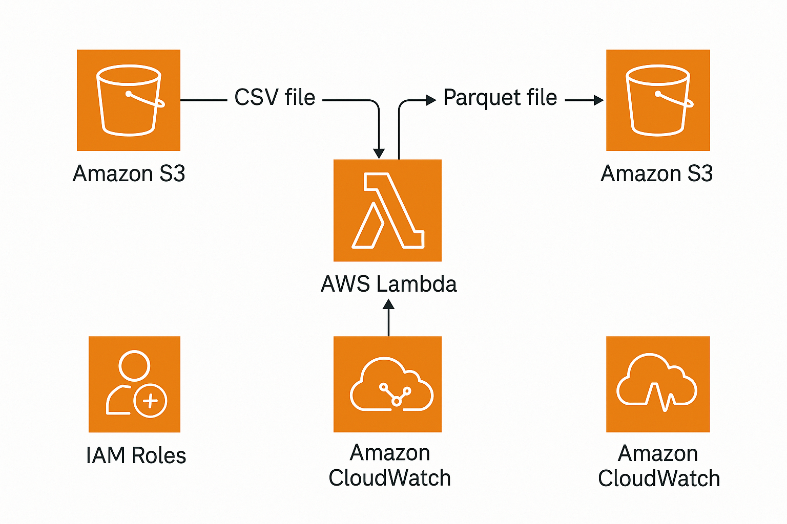
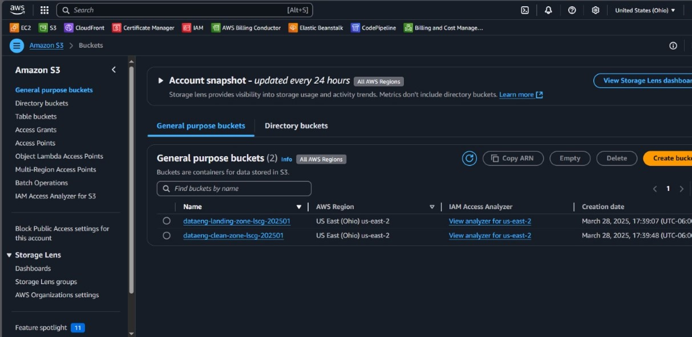
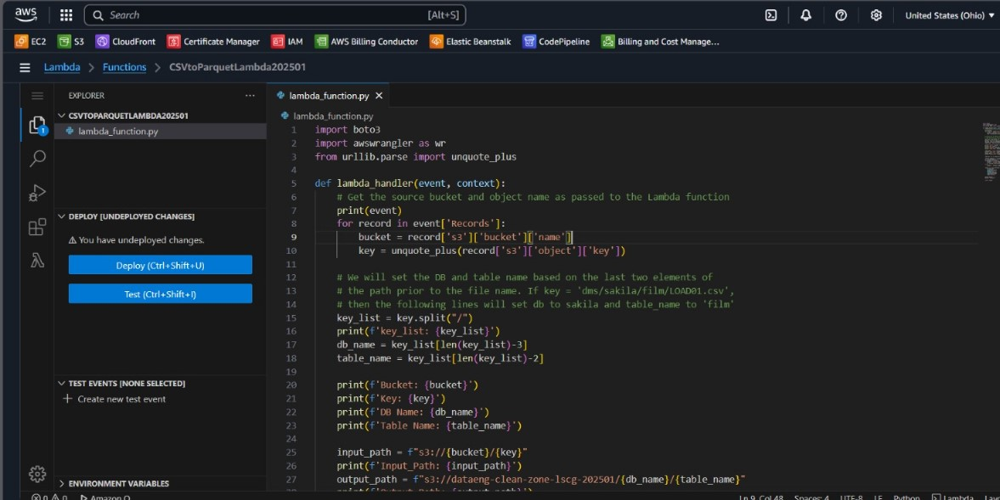
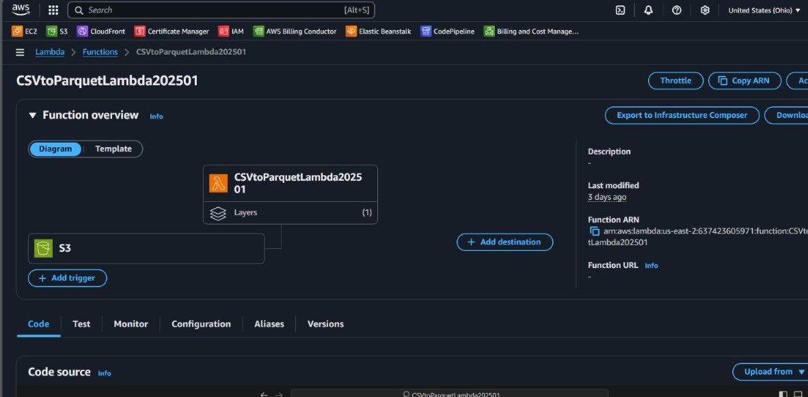
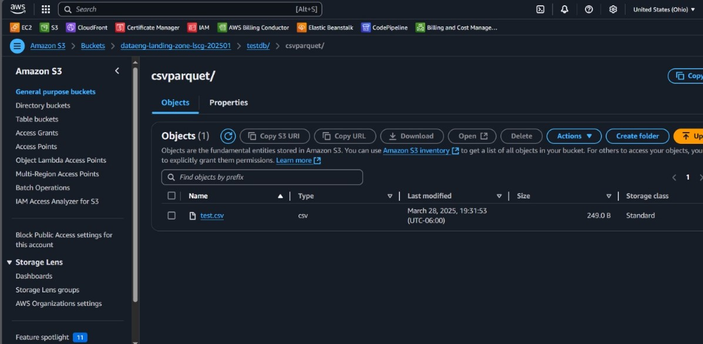
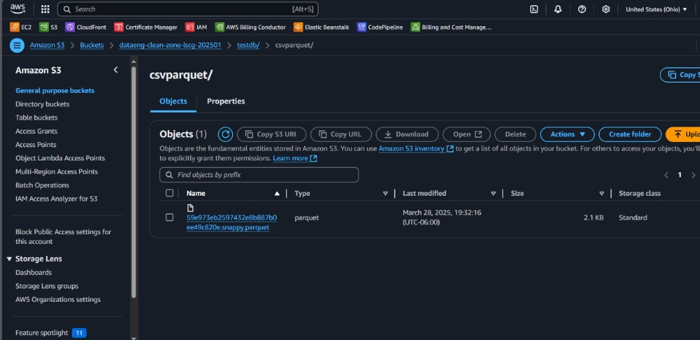
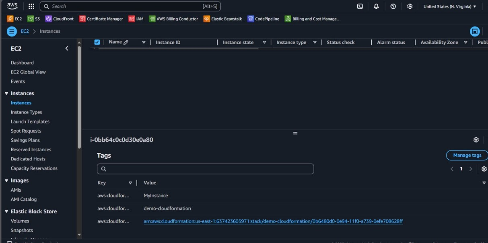

# CSV to Parquet Conversion with Amazon S3 and AWS Lambda

This project demonstrates how to automatically convert `.csv` files to `.parquet` format using **AWS Lambda** whenever a new file is uploaded to an **Amazon S3** bucket.

### Objective

The objective of this project is to trigger a Lambda function when a new `.csv` file is uploaded to a specific S3 prefix. The Lambda function reads the CSV file, converts it to Parquet format using Python libraries (`pandas`, `pyarrow`), and stores it in a different prefix within the same bucket.

---

## Table of Contents

- [Architecture](#architecture)
- [Cost](#cost)
- [Deployment](#deployment)
- [Monitoring](#monitoring)
- [Security](#security)
- [Learn More](#learn-more)

---

## Architecture

The architecture includes the following AWS components:

- **Amazon S3**: Stores input `.csv` files and output `.parquet` files.
- **AWS Lambda**: Triggered when a file is uploaded to the S3 bucket.
- **IAM Roles**: Grant Lambda permissions to read/write from/to S3.
- **Amazon CloudWatch**: Monitors and logs Lambda executions.

---

## Cost

Estimated cost is minimal due to the lightweight operations involved:

### 1. **Lambda Invocations**

- Free tier: 1 million requests/month
- ~1 invocation per file upload → **~$0.00**

### 2. **S3 Storage**

- Standard storage: $0.023 per GB/month
- Assuming less than 1GB storage → **~$0.02**

### 3. **CloudWatch Logs**

- Minimal logs (~5 MB) → **~$0.002**

**Total Estimated Cost**: ~**$0.02 - $0.03 USD** for small-scale testing

---

## Deployment

1. **Create S3 Buckets**

   Two Amazon S3 buckets were created with all public access blocked to enhance security:

   - `dataeng-landing-zone-lscg`: Used as the landing zone for incoming raw `.csv` files.
   - `dataeng-clean-zone-lscg`: Used to store the transformed `.parquet` files.

   Within the landing zone bucket, a folder (prefix) named `testdb/csvparquet/` was created to organize the raw CSV files. The clean zone bucket mirrors the structure to store the converted Parquet files.

   

2. **Develop Lambda Function**

   A Python 3.8 Lambda function named `CSVtoParquetLambda` was created. This function:

   - Extracts the uploaded `.csv` file’s name and path from the S3 event trigger.
   - Downloads the file from the landing zone bucket using `awswrangler` (AWS Data Wrangler).
   - Converts the CSV content into `.parquet` format using AWS Data Wrangler.
   - Uploads the resulting `.parquet` file to the clean zone bucket (`dataeng-clean-zone-lscg`) with a folder structure that mirrors the input path.
   - Optionally creates and catalogs the corresponding Glue database and table if they do not already exist.

   The Lambda function’s code was written and deployed using the AWS Lambda inline editor.

   

3. **Configure Lambda Trigger**

   The Lambda function was configured to automatically trigger on `s3:ObjectCreated:*` events in the `testdb/csvparquet/` prefix of the `dataeng-landing-zone-lscg` bucket.

   The trigger ensures that the Lambda function runs each time a new `.csv` file is uploaded to that location.

   

4. **Upload CSV to S3**

   A test `.csv` file named `test.csv` was created and uploaded into the `testdb/csvparquet/` folder of the `dataeng-landing-zone-lscg` bucket. This upload action automatically triggered the Lambda function.

   

5. **Check Output in Parquet Folder**

   After the Lambda function completed processing, the resulting `.parquet` file was successfully written to the `dataeng-clean-zone-lscg` bucket. The output file retained the same base name as the original `.csv` and followed the same internal folder structure (`testdb/csvparquet/`), ensuring consistency between input and output locations.

   This validated that the Lambda function executed the transformation properly and uploaded the `.parquet` result in the correct destination bucket and folder.

   

6. **CloudFormation Integration (Infrastructure as Code)**

   To ensure repeatability and automation, a CloudFormation stack named `demo-cloudformation` was launched. This stack provisioned key AWS infrastructure components such as:

   - An EC2 instance for auxiliary or monitoring tasks (as needed).
   - IAM roles with the necessary permissions for Lambda and S3 interaction.
   - Any other supporting resources needed for the project environment.

   The EC2 instance deployed via the stack was automatically tagged using CloudFormation metadata, demonstrating the effective use of infrastructure as code (IaC) to manage and version AWS deployments.

   

---

## Monitoring

- **CloudWatch Logs**: Used to verify successful execution and diagnose any Lambda function errors.
- **S3 Console**: To validate file conversion and output location.

---

## Security

- **S3 Bucket Policy**: Configured to block public access.
- **IAM Role**: Created for Lambda with `s3:GetObject` and `s3:PutObject` permissions.
- **Least Privilege Principle**: Ensured by restricting the Lambda role only to the necessary S3 actions.

---

## Learn More

- [AWS Lambda Documentation](https://docs.aws.amazon.com/lambda/)
- [Amazon S3 Documentation](https://docs.aws.amazon.com/s3/)
- [Amazon CloudWatch](https://docs.aws.amazon.com/cloudwatch/)
