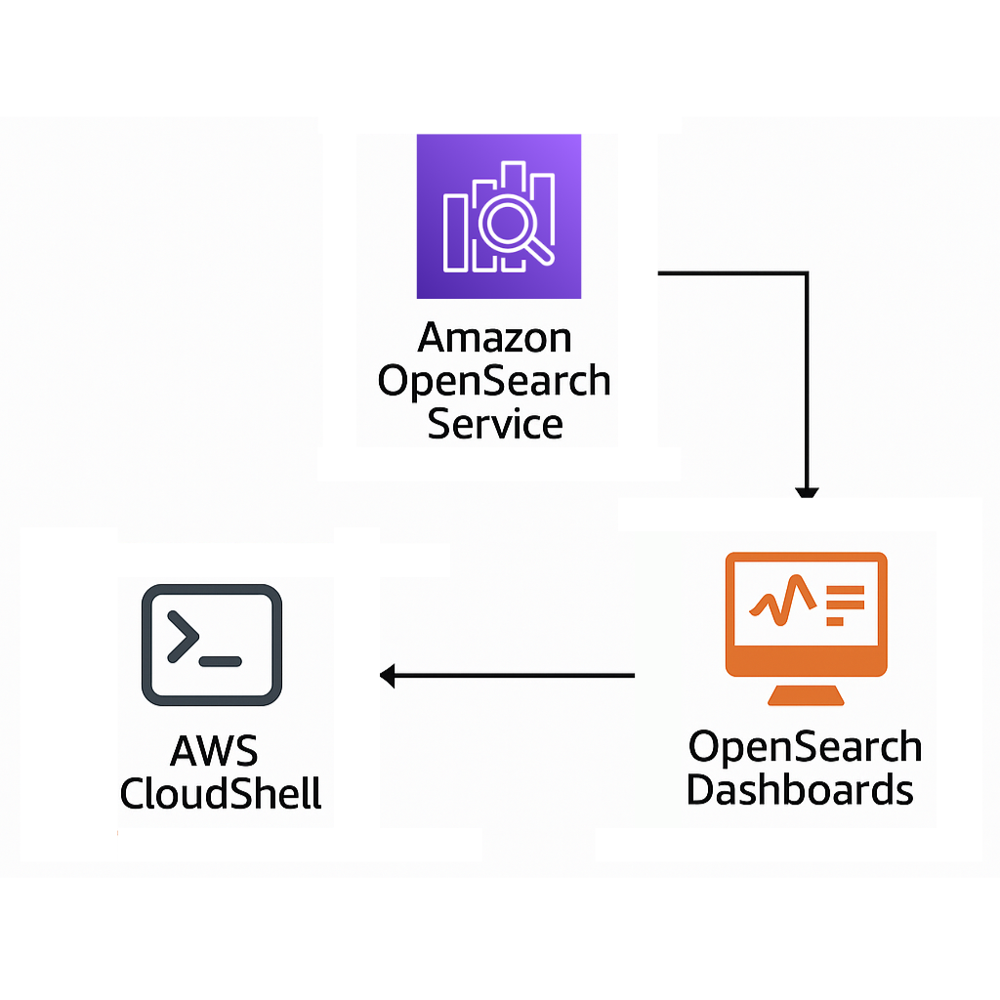
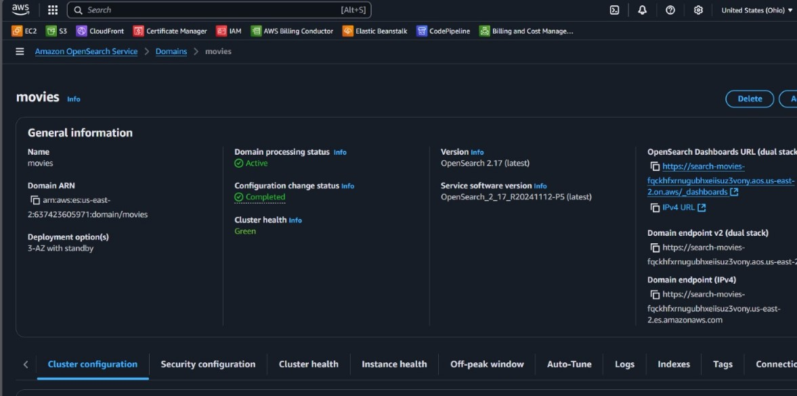
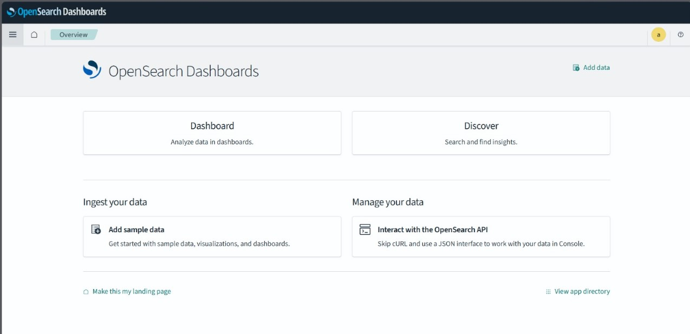
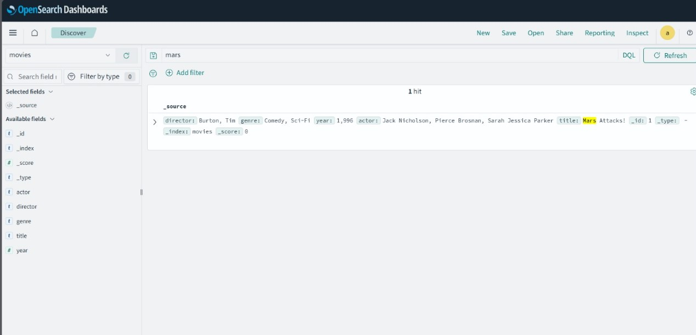
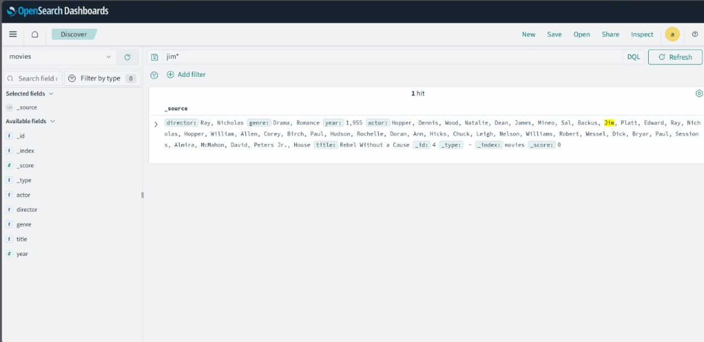
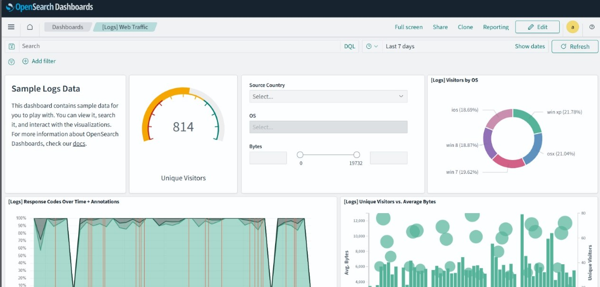
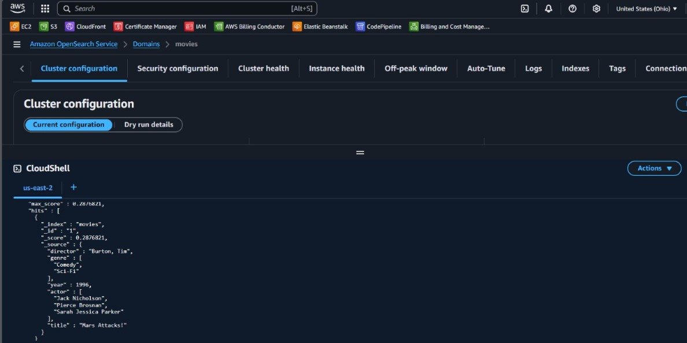

# Amazon OpenSearch Lab

This project documents a hands-on practice using **Amazon OpenSearch**. The lab demonstrates how to create an OpenSearch domain, ingest data, perform queries, and visualize data through the OpenSearch Dashboards.

---

## Objective

The objective of this lab is to understand how to work with Amazon OpenSearch for full-text search, analysis, and visualization. The goals included:

- Create and configure an OpenSearch domain.
- Use the OpenSearch Dashboard to visualize and query data.
- Ingest sample data and perform structured searches.
- Review configuration and monitor cluster status.

---

## Table of Contents

- [Architecture](#architecture)
- [Cost](#cost)
- [Deployment](#deployment)
- [Monitoring](#monitoring)
- [Security](#security)
- [Learn More](#learn-more)

---

## Architecture

The architecture consists of the following AWS components:

- **Amazon OpenSearch Domain**: A domain named `movies`.
- **OpenSearch Dashboard**: Interface for queries and data visualization.
- **AWS CloudShell**: Used to perform queries manually.
- **Sample Data**: Used for dashboard visualization and testing.

---

## Cost

This lab uses free-tier eligible resources. Estimated cost:

## Deployment

### 1. **Create the OpenSearch Domain**

We began by logging into the AWS Management Console and navigating to **Amazon OpenSearch Service**. From there, we created a new domain named `movies`. The following configurations were made:

- **Domain name**: `movies`
- **Engine version**: OpenSearch 2.17, the latest stable release
- **Deployment type**: Multi-AZ with standby, ensuring high availability
- **Access control**: Fine-grained access control enabled by default
- **Instance type and count**: Default values used for this basic lab
- **Storage settings**: EBS-enabled with default volume size
- **Cluster health**: Verified to be Green post-deployment, indicating a healthy configuration with no issues

We noted the OpenSearch Dashboard URL and domain endpoints, which would be used in later steps.

---

### 2. **Access OpenSearch Dashboards**

After successful domain creation, we clicked the **OpenSearch Dashboards URL** to open the UI. Upon loading the interface, we explored the main functionalities:

- **Dashboard**: For building and viewing data visualizations.
- **Discover**: For running DQL queries and inspecting index data.
- **Sample data**: Option to import sample datasets for analysis.
- **API interaction**: Enabled access to OpenSearch REST APIs for advanced operations.

This step was crucial to ensure connectivity and prepare the UI environment for further analysis.

---

### 3. **Query Data Using Discover**

Next, we accessed the **Discover** section of the OpenSearch Dashboards and selected the `movies` index.

We performed queries using the **DQL (Dashboards Query Language)** to inspect our dataset. Actions taken included:

- Searching for movie titles with keywords like `"mars"`.
- Exploring actor metadata using fields like `actors` and `genres`.
- Filtering specific genres such as `"Comedy"` or `"Sci-Fi"`.
- Highlighting relevant results, showcasing full JSON responses.

This helped understand how OpenSearch indexes and retrieves structured JSON data in real-time.

---

### 4. **Visualize Data in Dashboards**

We enriched the experience by importing **sample data** (logs) to test OpenSearch’s visualization capabilities.

- Navigated to the **Dashboards** tab.
- Created visualizations such as pie charts, bar graphs, and line plots using fields from the sample dataset.
- Monitored key metrics like “Unique Visitors”, log frequency, and source breakdowns.
- Combined visual elements into a unified dashboard panel.

This gave us a complete overview of how OpenSearch Dashboards can turn raw data into visual insights.

---

### 5. **Use AWS CloudShell to Query the Cluster**

To deepen understanding, we opened **AWS CloudShell** and ran a raw query against the OpenSearch endpoint. This allowed us to bypass the Dashboard UI and directly interact with the domain.

- Accessed the `movies` domain via CloudShell.
- Ran a custom JSON query to retrieve indexed documents.
- Used structured queries like `match`, `sort`, and `source filtering`.
- Results were printed in JSON format, showing fields such as `title`, `year`, and `actors`.

This method of querying is particularly useful for debugging, automation, or interacting with OpenSearch programmatically.

---

## Monitoring

- **Dashboard**: Used to monitor data and visualizations.
- **Cluster Configuration View**: Reviewed cluster status, instance health, and configuration history.
- **CloudShell**: Monitored responses and performance of manual queries.

---

## Security

- OpenSearch domain was configured with basic access settings.
- Access to the Dashboard was protected through the domain endpoint.
- IAM roles and policies were assumed for CloudShell usage.

---

## Learn More

- [Amazon OpenSearch Documentation](https://docs.aws.amazon.com/opensearch-service/index.html)
- [OpenSearch Dashboards](https://opensearch.org/docs/latest/dashboards/)
- [OpenSearch DQL Syntax](https://opensearch.org/docs/latest/query-dsl/)
