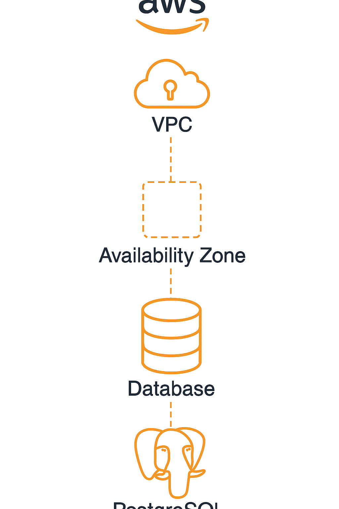
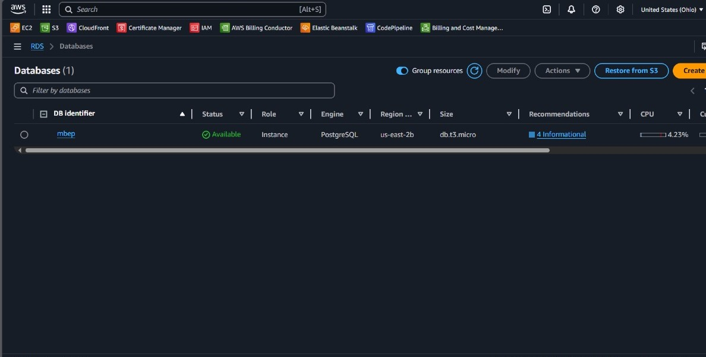
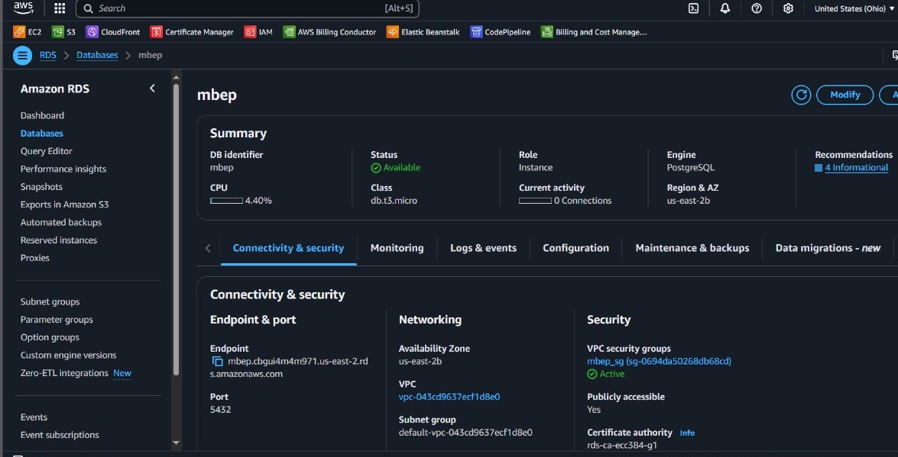
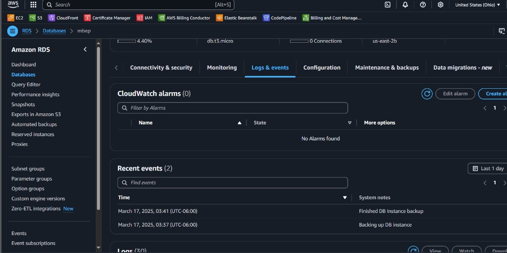

# Amazon RDS Database Creation Practice (PostgreSQL)

This project demonstrates how to create and manage a PostgreSQL database instance using **Amazon RDS**. The practice includes setting up the RDS instance, configuring networking and security, and verifying monitoring and logging through the AWS Console.

---

### Objective

The objective of this practice is to guide users through the steps required to launch a managed PostgreSQL instance using **Amazon Relational Database Service (RDS)**, providing automated backups, monitoring, and secure access.

---

## Table of Contents

- [Architecture](#architecture)
- [Cost](#cost)
- [Deployment](#deployment)
- [Monitoring](#monitoring)
- [Security](#security)
- [Learn More](#learn-more)

---

## Architecture

The architecture includes:

- **AWS** account for hosting resources.
- **VPC (Virtual Private Cloud)** for network isolation.
- **Availability Zone** to ensure high availability.
- **Amazon RDS Instance** hosting PostgreSQL.
- **Security Groups** to control inbound/outbound traffic.
- **CloudWatch** for monitoring and logs.

---

## Cost

This practice was executed on a **free-tier eligible** RDS instance:

- **Instance type**: db.t3.micro (eligible for free-tier)
- **Engine**: PostgreSQL
- **Region**: us-east-2

No additional cost was incurred as long as usage remains within AWS Free Tier limits.

### Estimated Real Cost (If Not in Free Tier)

If usage exceeds the Free Tier, approximate monthly costs would be:

**Instance Cost**:
db.t3.micro on-demand in us-east-2:
~$0.0208 per hour → ~$15.00 per month (720 hours)

**Storage Cost**:
20 GB allocated → $0.115 per GB-month
20 × $0.115 = $2.30/month

**Backup Storage Cost** (beyond free tier):
Assuming 5 GB of backup beyond free limit →
5 × $0.095 = $0.475/month

### Total Estimated Monthly Cost (Without Free Tier):

**$17.78 USD**
This is a rough estimate for minimal usage; actual costs may vary depending on usage patterns, snapshot storage, IOPS, and network transfer.

## Deployment

### 1. Launch RDS Instance

- Navigate to **Amazon RDS** in the AWS Management Console.
- Click **Create database**.
- Choose **Standard Create** and **PostgreSQL** engine.
- Select **Free tier** template.
- Set **DB instance identifier** (e.g., `mbep`).
- Set username and password.
- Choose **db.t3.micro** instance class.

> 

### 2. Configure Connectivity

- Ensure it is placed within a **VPC**.
- Assign appropriate **Availability Zone**.
- Create or select a **security group** to allow access (e.g., port 5432 for PostgreSQL).

### 3. Enable Monitoring & Logging

- Enable **CloudWatch logs** for error/debug tracking.
- Allow automated backups for data durability.

> 

---

## Monitoring

AWS CloudWatch was used to monitor database performance and events:

- View recent logs and events under the **Logs & Events** tab.
- Track DB CPU usage, connections, and storage metrics.

> 

---

## Security

To protect the RDS instance:

1. **VPC Security Group Rules**

   - Only allow inbound connections on port 5432 from trusted IPs.

2. **Database Credentials**

   - Use secure username/password combinations.

3. **IAM Roles (optional)**
   - Can be used for advanced control or automation.

---

## Learn More

- [Amazon RDS Documentation](https://docs.aws.amazon.com/rds/)
- [PostgreSQL on AWS RDS](https://docs.aws.amazon.com/AmazonRDS/latest/UserGuide/CHAP_PostgreSQL.html)
- [CloudWatch Documentation](https://docs.aws.amazon.com/cloudwatch/)
