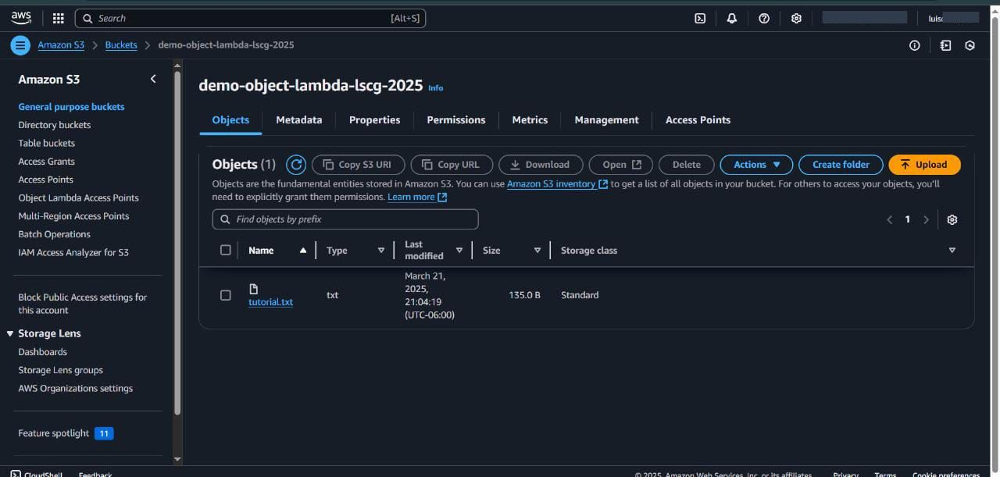
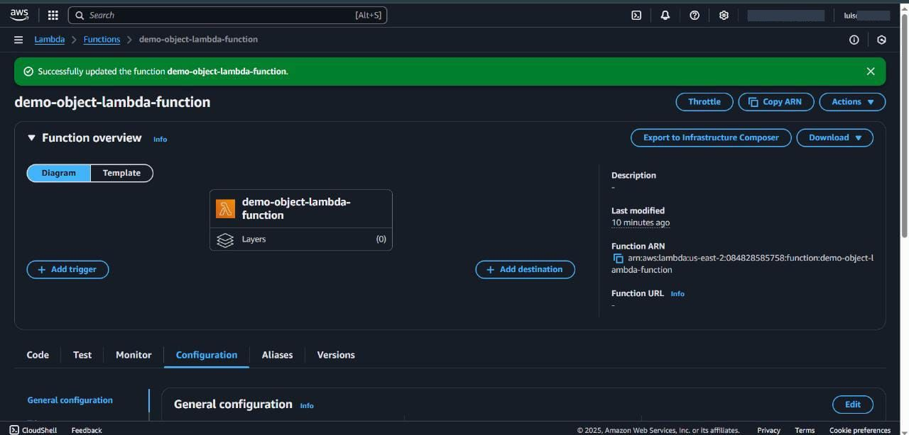
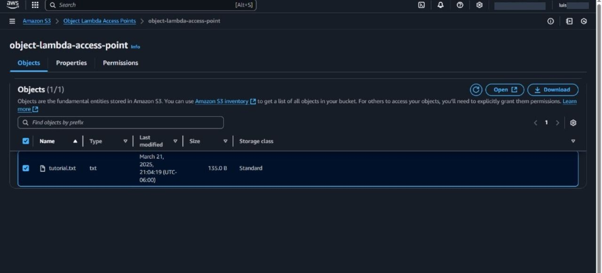

# Object Transformation with Amazon S3 Object Lambda

This project demonstrates how to use Amazon S3 Object Lambda to dynamically modify the content of objects stored in S3 when they are requested by an application. By associating an AWS Lambda function with an S3 Object Lambda access point, it is possible to intercept GET requests and apply custom transformations to objects before sending them to the client.

### Objetive

The objetive of this project is to show how the read behavior of S3 objects can be customized using Amazon S3 Object Lambda. By implementing a Lambda function, you can modify the way data is presented to consumers without duplicating or altering the data stored in S3.

---

## Table of Contents

- [Architecture](#architecture)
- [Cost](#cost)
- [Deployment](#deployment)
- [Monitoring](#monitoring)
- [Security](#security)
- [Learn More](#learn-more)

---

## Architecture

The project architecture includes the following components:

- **S3 Bucket**: Stores the original objects.
- **S3 Access Point**: Provides access to the S3 bucket.
- **Lambda Function**: Processes and transforms the retrieved objects.
- **S3 Object Lambda Access Point**: Intercepts GET requests and routes the flow through the Lambda function.

---

## Cost

The project utilizing **AWS S3 Object Lambda** to convert text to uppercase has been estimated for **one single day of usage**, with only **5 requests** made. Below are the calculated costs:

## 1. **GET Requests to S3**

- **Cost per 1,000,000 requests**: **$0.40 USD**
- **Cost per GET request**:  
  0.40 USD / 1,000,000 = 0.0000004 USD per request
- **Cost for 5 requests**:  
  5 \* 0.0000004 USD = 0.000002 USD

## 2. **Lambda Functions**

- **Cost per 1,000,000 Lambda executions**: **$0.20 USD**
- **Cost per Lambda execution**:  
  0.20 USD / 1,000,000 = 0.0000002 USD per execution
- **Cost for computation (1 second of execution and 512 MB)**:  
  8.35 USD / 1,000,000 = 0.00000835 USD per execution
- **Cost for 5 Lambda requests**:  
  5 \* (0.0000002 USD + 0.00000835 USD) = 0.00004175 USD

## 3. **Data Return**

- **Cost per 1,000,000 requests with 500 KB per object**: **$2.50 USD**
- **Cost per returned object (500 KB)**:  
  2.50 USD / 1,000,000 = 0.0000025 USD per object
- **Cost for 5 returned objects**:  
  5 \* 0.0000025 USD = 0.0000125 USD

## **Total Estimated Cost for 5 Requests in 1 Day**

- **GET Requests**: 0.000002 USD
- **Lambda Functions**: 0.00004175 USD
- **Data Return**: 0.0000125 USD

**Total cost for 5 requests**:  
0.000002 + 0.00004175 + 0.0000125 = 0.00005625 USD

## **Summary**

The total estimated cost for using the AWS S3 Object Lambda service during **one day with only 5 requests** is **approximately 0.00005625 USD**.

This cost is extremely low due to the limited number of requests and usage confined to a single day.

---

## Deployment

To deploy this project and start transforming objects using Amazon S3 Object Lambda, several key steps are required in configuring the necessary resources in AWS.

1. **Create an S3 Bucket**
   It is necessary to create a bucket in Amazon S3 where the objects to be transformed by the Lambda function will be stored. This bucket will act as the repository for the original data before it is modified.

2. **Upload a File to the S3 Bucket**
   Once the bucket is created, upload a file (e.g., a text file) that will be processed by the Lambda function. This file will serve as a test to ensure that the transformations are correctly applied to the content stored in S3.

3. **Create an S3 Access Point**
   An S3 access point is configured to provide access to the previously created bucket. This access point is essential to allow read and write requests to be managed efficiently, especially when integrated with services like S3 Object Lambda.

4. **Develop the Lambda Function**
   A Lambda function should be created to implement the custom transformation logic. In this case, the Lambda function takes the object stored in S3 and applies a transformation, such as converting the text to uppercase, before returning it to the requesting application. This function must be configured to respond to S3 object access events.

5. **Configure an IAM Policy**
   For the Lambda function to interact correctly with the S3 bucket and other services, an IAM policy must be created and configured to grant the necessary permissions. The policy must allow Lambda to get objects from the S3 bucket and log events in CloudWatch, among other permissions required for operation.

6. **Create an S3 Object Lambda Access Point**
   The next step is to create an S3 Object Lambda access point, which links to the original S3 access point and the Lambda function created. This access point manages the GET requests to allow the objects to be transformed in real-time as they are requested.

7. **Test the Transformation**
   Once all resources are configured, a test can be performed by making a GET request through the S3 Object Lambda access point. This will verify that the Lambda function has correctly transformed the file content, applying the configured modification.

---

## Monitoring

To ensure the proper functioning and security of the project, monitoring tools were implemented using **CloudWatch**:

1. **AWS CloudWatch**
   **CloudWatch logs** were configured to capture events generated by the Lambda function during its execution. This allows real-time monitoring of the Lambda's behavior, detecting potential errors and performance issues, and ensuring that transformations are performed correctly.

---

## Security

To ensure the protection of data and proper access to resources in this project, several security measures were implemented following AWS best practices:

1. **IAM Policies for Lambda Function**
   IAM policies were configured specifically for the Lambda function, ensuring it only has **read** (`s3:GetObject`) permissions for objects in the S3 bucket. Additionally, permissions for **logging** in CloudWatch were enabled, allowing monitoring of the Lambda function.

2. **Access Control to Objects in S3**
   **Bucket policies** were established to restrict access to objects only to the Lambda function associated with the S3 Object Lambda access point. This ensures that only requests processed by the Lambda can access the stored data.

3. **Authorization of Access via S3 Object Lambda**
   The S3 Object Lambda access point was configured to ensure that only **GET requests**, managed by the Lambda function, can access the objects. This reinforces control over who can perform transformations and access the data.

---

## Learn More

Explore the tools and technologies used in this project:

- [Amazon S3 Documentation](https://docs.aws.amazon.com/s3/)
- [AWS Lambda Documentation](https://docs.aws.amazon.com/lambda/)
- [Amazon S3 Object Lambda](https://docs.aws.amazon.com/AmazonS3/latest/userguide/transforming-objects.html)
