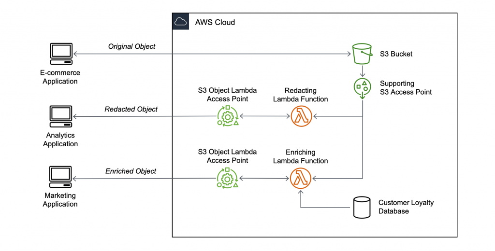

## Architecture

The project architecture includes the following components:

- **S3 Bucket**: Stores the original objects.
- **S3 Access Point**: Provides access to the S3 bucket.
- **Lambda Function**: Processes and transforms the retrieved objects.
- **S3 Object Lambda Access Point**: Intercepts GET requests and routes the flow through the Lambda function.

