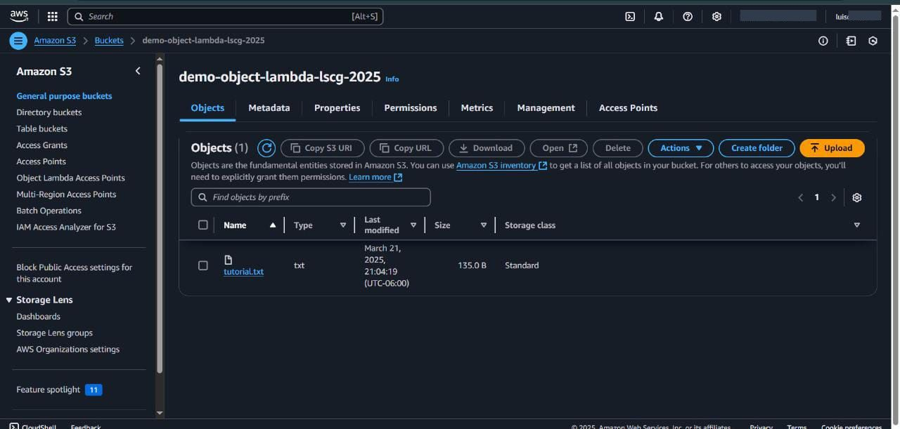
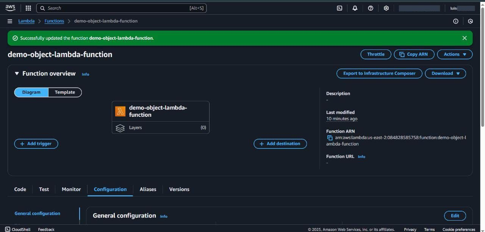
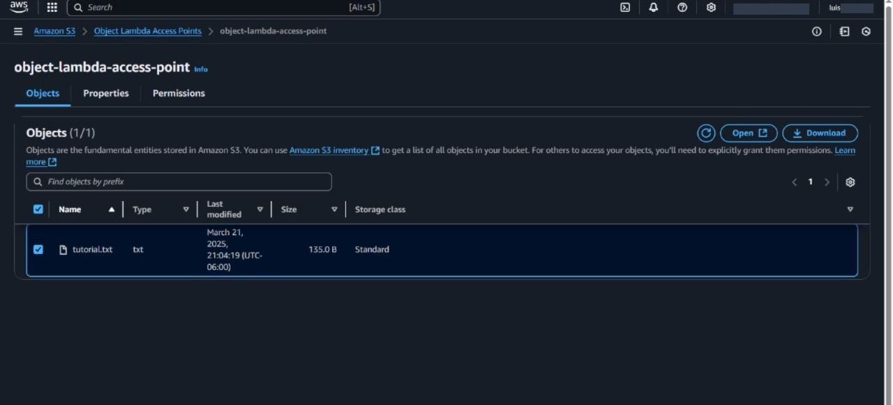
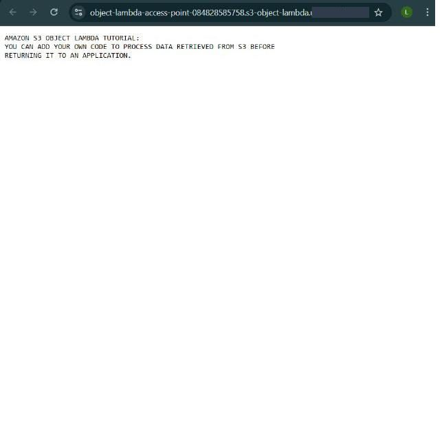

## Deployment

To deploy this project and start transforming objects using Amazon S3 Object Lambda, several key steps are required in configuring the necessary resources in AWS.

1. **Create an S3 Bucket**
   It is necessary to create a bucket in Amazon S3 where the objects to be transformed by the Lambda function will be stored. This bucket will act as the repository for the original data before it is modified.

2. **Upload a File to the S3 Bucket**
   Once the bucket is created, upload a file (e.g., a text file) that will be processed by the Lambda function. This file will serve as a test to ensure that the transformations are correctly applied to the content stored in S3.

3. **Create an S3 Access Point**
   An S3 access point is configured to provide access to the previously created bucket. This access point is essential to allow read and write requests to be managed efficiently, especially when integrated with services like S3 Object Lambda.

4. **Develop the Lambda Function**
   A Lambda function should be created to implement the custom transformation logic. In this case, the Lambda function takes the object stored in S3 and applies a transformation, such as converting the text to uppercase, before returning it to the requesting application. This function must be configured to respond to S3 object access events.

5. **Configure an IAM Policy**
   For the Lambda function to interact correctly with the S3 bucket and other services, an IAM policy must be created and configured to grant the necessary permissions. The policy must allow Lambda to get objects from the S3 bucket and log events in CloudWatch, among other permissions required for operation.

6. **Create an S3 Object Lambda Access Point**
   The next step is to create an S3 Object Lambda access point, which links to the original S3 access point and the Lambda function created. This access point manages the GET requests to allow the objects to be transformed in real-time as they are requested.

7. **Test the Transformation**
   Once all resources are configured, a test can be performed by making a GET request through the S3 Object Lambda access point. This will verify that the Lambda function has correctly transformed the file content, applying the configured modification.

