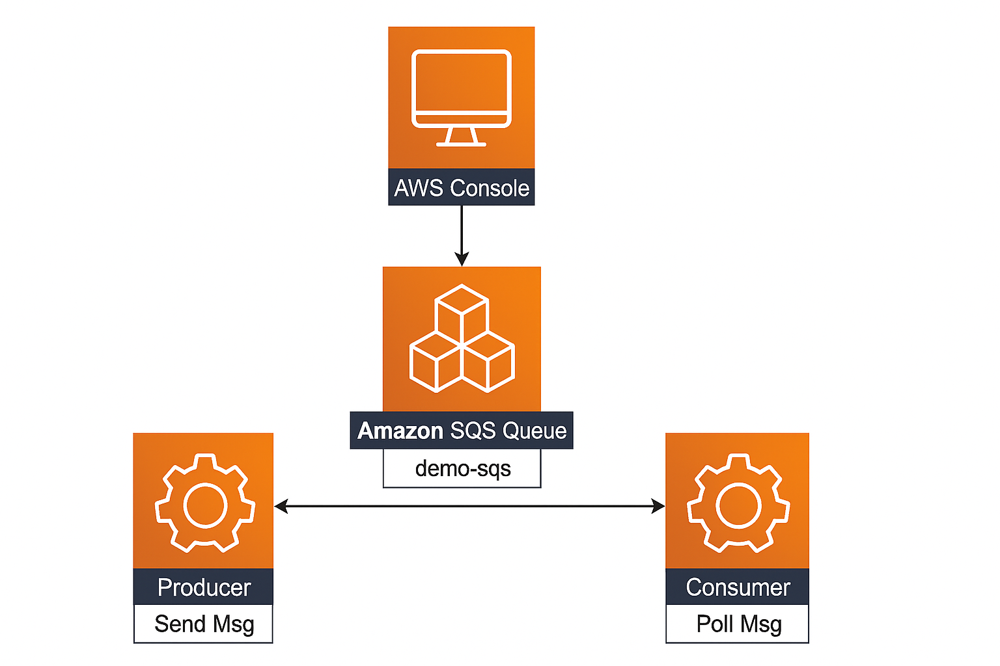
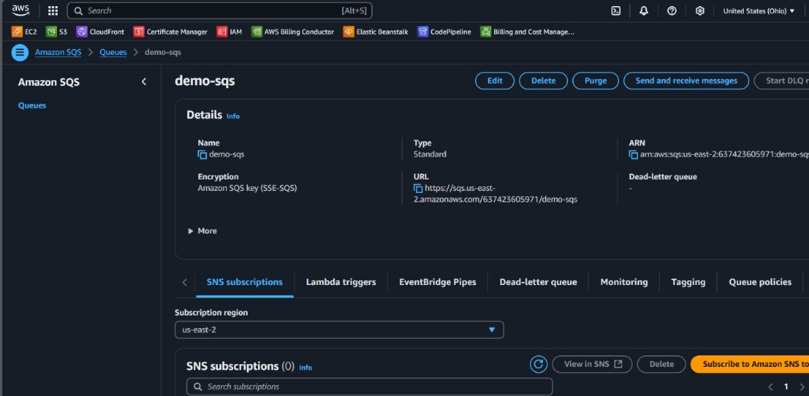
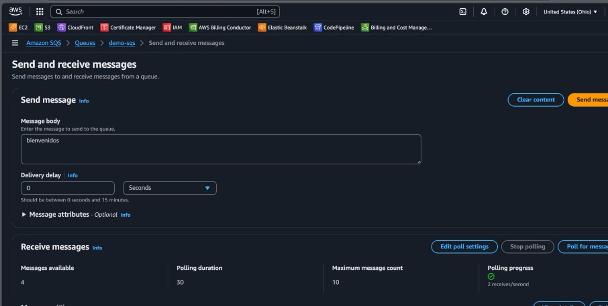
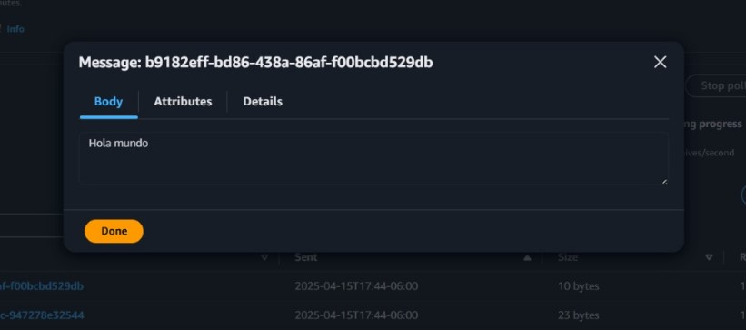

# Amazon SQS Lab

This project documents a hands-on practice using **Amazon Simple Queue Service (SQS)**. The lab demonstrates how to create an SQS queue, send a message, and receive a message using the AWS Management Console.

---

## Objective

The objective of this lab is to understand the basics of Amazon SQS by performing the following:

- Create and configure an Amazon SQS standard queue.
- Send messages to the queue.
- Retrieve and view messages from the queue.

---

## Table of Contents

- [Architecture](#architecture)
- [Cost](#cost)
- [Deployment](#deployment)
- [Monitoring](#monitoring)
- [Security](#security)
- [Learn More](#learn-more)

---

## Architecture

The architecture involves the following AWS component:

- **Amazon SQS**: A fully managed message queuing service that enables decoupling and communication between distributed systems.

### Components Used

- **SQS Queue**: A queue named `demo-sqs` was created.
- **AWS Console**: Used to create the queue and interact with messages.

---

## Cost

### 1. **Amazon SQS**

- Free tier: 1 million requests/month
- This lab uses far fewer requests (less than 100)

### 2. **Data Transfer**

- In-region data transfer is free for minimal console interactions

**Estimated Total**: $0.00–$0.01 for short usage

---

## Deployment

### 1. **Create the SQS Queue**

We logged into the **AWS Console**, navigated to **Amazon SQS**, and created a standard queue with the following configuration:

- **Queue name**: `demo-sqs`
- **Type**: Standard (default)
- **Encryption**: Amazon SQS managed encryption (SSE-SQS)

Once created, we verified the details of the queue such as URL, ARN, and basic settings.

---

### 2. **Send a Message to the Queue**

After the queue was successfully created, we proceeded to send a message to it. We used the **Send and receive messages** tab in the console.

- **Message body**: `"bienvenidos"`
- **Delivery delay**: 0 seconds (default)
- We clicked **Send message** to enqueue it.

This simulates a producer sending data to a distributed system.

---

### 3. **Receive a Message from the Queue**

To simulate a consumer, we polled the queue for available messages:

- Clicked on **Poll for messages**
- Retrieved a message with body content: `"Hola mundo"`
- Viewed the message in the console and clicked **Done** after reading

This step validated that the system is functioning end-to-end for basic message flow.

---

## Monitoring

The monitoring of message delivery and retrieval was done through the built-in console interface, which shows:

- Number of messages available
- Polling progress and count
- Message visibility and details

For deeper monitoring, CloudWatch could be integrated (not covered in this basic lab).

---

## Security

- No specific IAM policies or VPC endpoints were configured for this lab.
- The SQS queue used default access permissions for simplicity.
- All operations were performed under a single AWS account.

---

## Learn More

- [Amazon SQS Documentation](https://docs.aws.amazon.com/sqs/)
- [Using the AWS Console to interact with SQS](https://docs.aws.amazon.com/AWSSimpleQueueService/latest/SQSDeveloperGuide/sqs-console.html)
- [SQS Message Lifecycle](https://docs.aws.amazon.com/AWSSimpleQueueService/latest/SQSDeveloperGuide/sqs-how-it-works.html)
