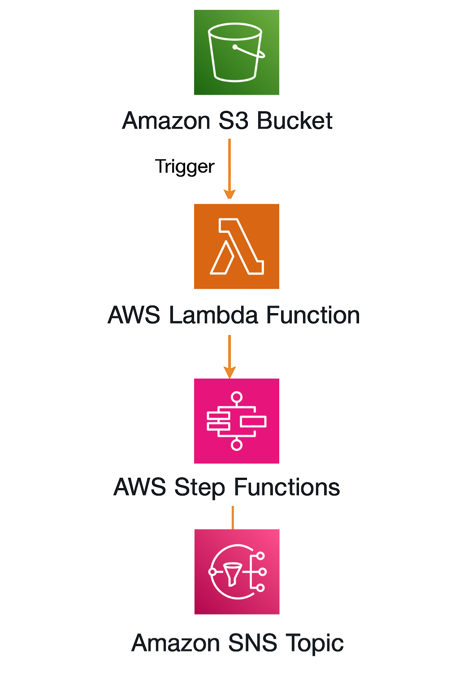
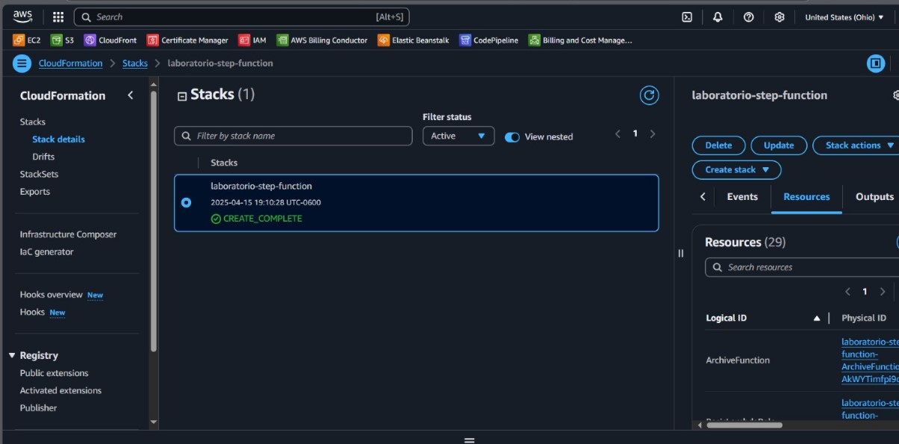
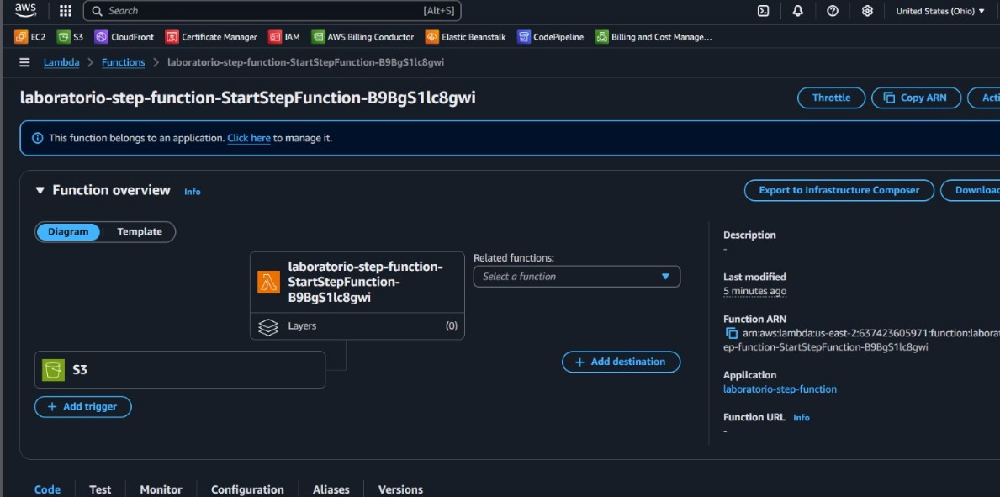
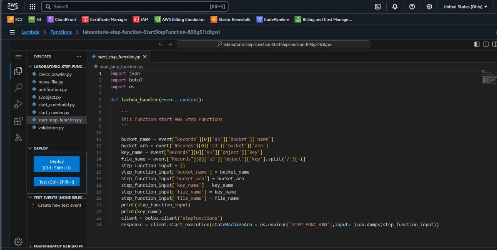
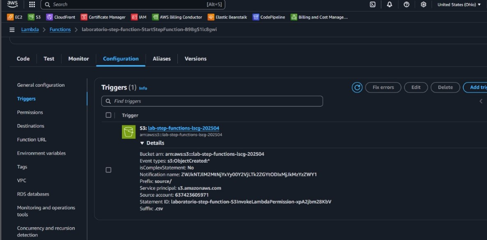
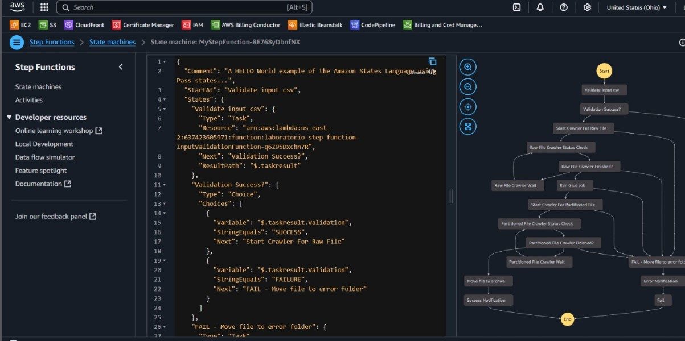
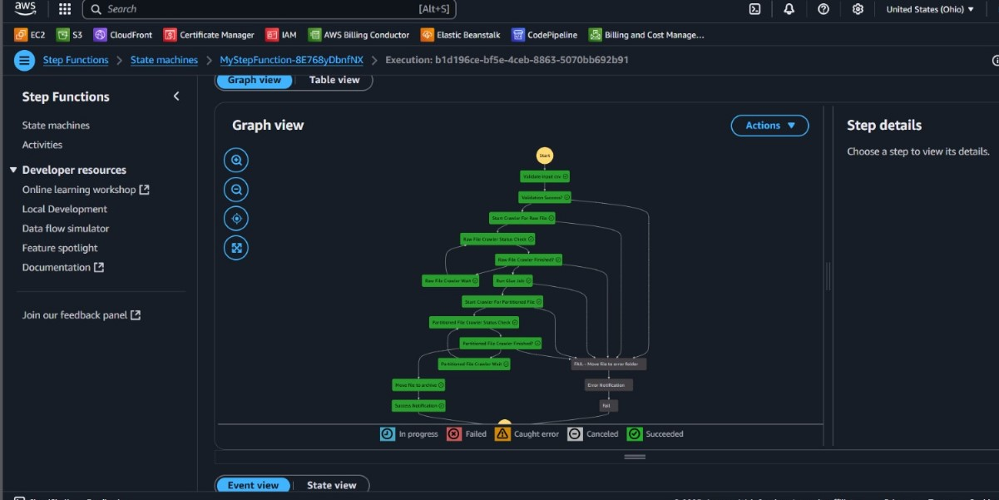
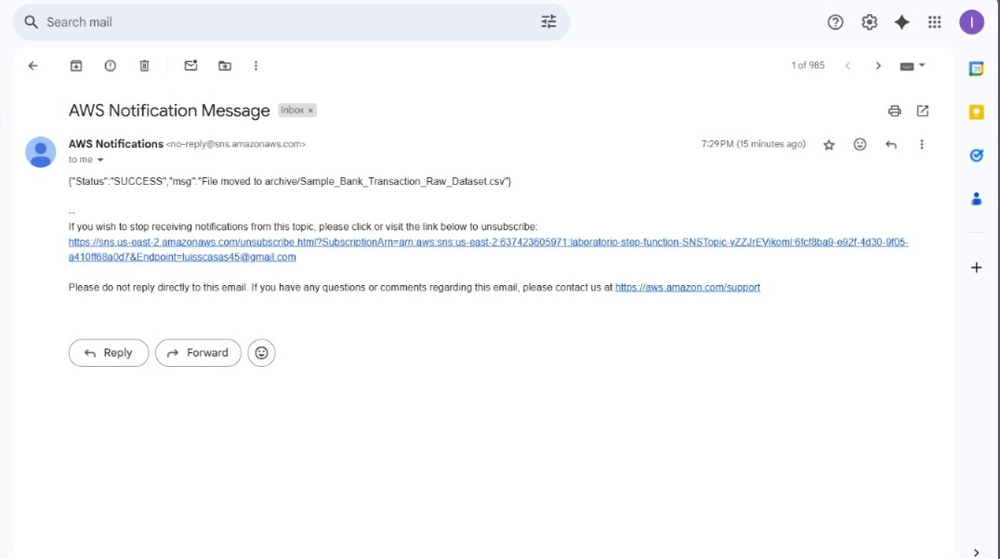

# Step Functions with S3, Lambda, and SNS Integration

This project documents a hands-on practice using **AWS Step Functions** integrated with **Amazon S3**, **AWS Lambda**, and **Amazon SNS**. The purpose of this practice was to create an event-driven pipeline triggered by file uploads to S3, processed by Lambda, orchestrated with Step Functions, and concluded with notification delivery through SNS.

---

## Objective

The objective of this lab was to implement an event-driven architecture using Step Functions, S3, Lambda, and SNS to automate data processing based on file uploads. The goals included:

- Creating a complete architecture using AWS CloudFormation.
- Building and configuring a Lambda function that starts a Step Function.
- Configuring an S3 bucket to trigger the Lambda function.
- Designing a Step Function to process different validation steps.
- Sending an SNS notification with the execution result.

---

## Table of Contents

- [Architecture](#architecture)
- [Cost](#cost)
- [Deployment](#deployment)
- [Monitoring](#monitoring)
- [Security](#security)
- [Learn More](#learn-more)

---

## Architecture

The architecture included the following AWS components:

- **Amazon S3**: To store the files that trigger the pipeline.
- **AWS Lambda**: To start the Step Function execution upon S3 events.
- **AWS Step Functions**: To orchestrate a multi-step processing workflow.
- **Amazon SNS**: To send a final success or failure notification.
- **CloudFormation**: To provision and manage all resources.

---

## Cost

### 1. **S3**

- **Storage**: ~$0.023 per GB/month (Standard class).
- Estimated usage: 1 GB for testing files.
  - **Cost**: ~$0.023

**Estimated Total for S3**: **~$0.03**

### 2. **Lambda**

- **Invocations**: $0.20 per 1 million requests.

  - Estimated 1,000 invocations: **~$0.0002**

- **Compute Time**: $0.0000166667 per GB-second.
  - Example: 128 MB used for 1 second per invocation
  - 0.125 GB _ 1 s _ 1,000 invocations = 125 GB-s
  - 125 \* $0.0000166667 = **~$0.00208**

**Estimated Total for Lambda**: **~$0.0023**

### 3. **Step Functions**

- $0.025 per 1,000 state transitions.
- Example: One execution with 20 state transitions
  - 20 \* $0.000025 = **~$0.0005**

**Estimated Total for Step Functions**: **~$0.0005**

### 4. **SNS**

- $0.50 per 1 million publishes.
- Example: 10 messages sent
  - 10 \* $0.0000005 = **~$0.000005**

**Estimated Total for SNS**: **~$0.00001**

- Total **~$0.033**

---

## Deployment

### 1. CloudFormation Stack Creation

The lab started by deploying a CloudFormation stack named `laboratorio-step-function`. This stack included all necessary resources such as the Lambda function, IAM roles, S3 bucket, SNS topic, and the Step Function definition.

We used a pre-configured template with defined logical resources and verified that the stack status changed to `CREATE_COMPLETE`. This confirmed that the infrastructure was deployed successfully and ready for testing.

---

### 2. Reviewing the Created Lambda Function

Next, we navigated to the Lambda console to review the function created by the CloudFormation stack. The function was named following the pattern `laboratorio-step-function-StartStepFunction-<suffix>`.

We validated its configuration, such as runtime (Python), IAM permissions, and attached triggers. No environment variables were needed at this stage, and we confirmed the function had permission to invoke the Step Function.

---

### 3. Lambda Code to Start Step Function

We edited the Lambda function code directly in the AWS Console. The Python handler extracted the S3 bucket and object key from the incoming event and constructed the input for the Step Function.

Key actions in the code:

- Parsing the bucket and key from the event.
- Extracting the file name without extension.
- Formatting the input JSON for the Step Function.
- Using the `boto3` Step Functions client to invoke the state machine.

This setup ensured that any uploaded file to the bucket would result in a dynamic Step Function execution.

---

### 4. Configuring S3 Trigger for Lambda

We then set up an S3 bucket trigger to invoke the Lambda function on `PUT` events. This meant that whenever a file was uploaded to the bucket, the Lambda function would automatically start the Step Function.

We confirmed that the correct bucket and event types were linked and that the trigger was active.

---

### 5. Step Function Definition and Configuration

The Step Function was defined using the Amazon States Language in JSON format. It contained a workflow with multiple parallel validations such as:

- Checking if the file is valid.
- Verifying folder structure.
- Moving the file to an error folder if validation failed.

The visual workflow graph confirmed the states and transitions. Each state used Lambda tasks or Pass states to simulate validation. The final step published the result to SNS.

---

### 6. Successful Execution of Step Function

After uploading a test file to the S3 bucket, the flow was triggered as expected. The Step Function execution appeared in the AWS Console with a complete and successful state.

We visualized the execution path using the Graph view, confirming that all steps were followed correctly without error.

---

### 7. SNS Notification for Final Result

At the end of the Step Function, a message was published to an Amazon SNS topic. We confirmed the delivery by checking the registered email inbox.

The notification contained a `SUCCESS` message and details of the processed file, confirming the workflow had completed as intended.

---

## Monitoring

- **Step Functions Console**: Used to monitor execution flow and debug transitions.
- **CloudWatch Logs**: Lambda execution details were available for debugging and tracking S3 event inputs.
- **Email**: SNS messages delivered to validate final status.

---

## Security

- **IAM Roles**: Each service had a dedicated role with the least privilege permissions.
- **Resource Isolation**: Resources were grouped logically via CloudFormation.
- **SNS Access**: Confirmed email subscription before notifications were received.

---

## Learn More

- [AWS Step Functions](https://docs.aws.amazon.com/step-functions/)
- [Amazon S3](https://docs.aws.amazon.com/s3/)
- [AWS Lambda](https://docs.aws.amazon.com/lambda/)
- [Amazon SNS](https://docs.aws.amazon.com/sns/)
- [AWS CloudFormation](https://docs.aws.amazon.com/cloudformation/)
