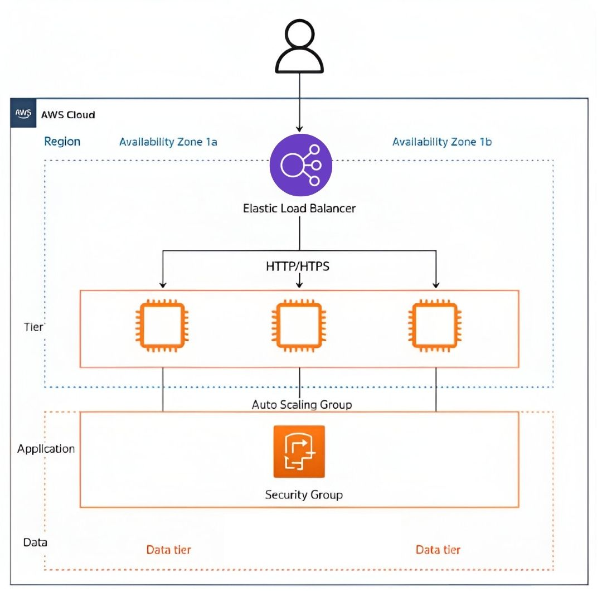

# Project: Load Balancer with Auto Scaling

This project implements an AWS architecture to balance traffic among multiple EC2 instances, redirecting requests to the instance with the lowest concurrency. The system also includes auto scaling policies (manual, scheduled, and dynamic), access restrictions by instance IP, and a single access path through the load balancer DNS.

### Objective

Ensure availability, scalability, and security of a group of EC2 instances through automated scaling and efficient traffic distribution.

---

## Table of Contents

- [Architecture](#architecture)
- [Cost](#cost)
- [Deployment](#deployment)
- [Monitoring](#monitoring)
- [Security](#security)
- [Learn More](#learn-more)

---

# Architecture

The architecture follows the principles of **three-tier** and **scalability** within AWS.

## Components

- **Elastic Load Balancer (ELB):** Distributes incoming traffic across multiple availability zones to ensure redundancy and availability.
- **EC2 Instances:** Host the application and report their load/concurrency levels.
- **Auto Scaling Group (ASG):** Manages the lifecycle of EC2 instances, launching or terminating them based on demand.
- **Launch Template:** Provides configuration for launching new instances, including AMI, instance type, and security groups.
- **CloudWatch Metrics & Alarms:** Monitor system performance and trigger automatic scaling actions based on defined thresholds.

## Network Access Explanation

The architecture is designed to enforce secure and controlled traffic flow by applying strict access rules through security groups:

- **Direct access from users to EC2 instances** → ❌ **Not allowed.**  
  These routes are intentionally blocked to prevent public exposure of the EC2 instances. This is represented by the red crosses in the diagram.

- **Access from users to the Load Balancer** → ✔️ **Allowed.**  
  The Load Balancer serves as the single entry point to the system, improving both security and traffic management.

This configuration minimizes attack surfaces while ensuring availability, scalability, and proper separation of concerns.



---

## Cost

This report estimates the cost of running a **load balancer with auto scaling** for **one single day**, with **2 EC2 instances active**, handling traffic through the **Elastic Load Balancer (ELB)** and being monitored using **CloudWatch**.

### 1. **EC2 Instances (t3.medium)**

- **Hourly rate per instance (on-demand)**: **$0.0416 USD**
- **2 instances for 24 hours**:  
  2 \* 24 \* 0.0416 = **$1.9968 USD**

### 2. **Elastic Load Balancer (Application Load Balancer)**

- **Hourly cost**: **$0.0225 USD**
- **Cost per GB processed**: **$0.008 USD** (assume 1 GB)
- **Total ELB cost for 24 hours and 1 GB traffic**:  
  (24 \* 0.0225) + 0.008 = **$0.548 USD**

### 3. **CloudWatch Metrics**

- **Custom metrics (3 metrics)**:  
  $0.30 USD per metric per month → ~$0.01/day/metric  
  3 \* 0.01 = **$0.03 USD**
- **CloudWatch Logs ingestion (1 MB)**:  
  $0.50 per GB → 0.0005 USD per MB  
  1 MB = **$0.0005 USD**

### 4. **Auto Scaling Group**

- **Auto Scaling itself has no cost**, only EC2 costs apply.
- Any instance launched by Auto Scaling counts as regular EC2 billing.

---

### **Total Estimated Cost for One Day**

- **EC2 Instances**: $1.9968 USD
- **Elastic Load Balancer**: $0.548 USD
- **CloudWatch Metrics**: $0.03 USD
- **CloudWatch Logs**: $0.0005 USD

**Total estimated cost for one day**:  
**$1.9968 + $0.548 + $0.03 + $0.0005 = $2.5753 USD**

### **Summary**

The total estimated cost for running the **Load Balancer with Auto Scaling and Monitoring** for a single day with basic traffic and monitoring is **approximately $2.58 USD**.

---

## Dynamic Deployment

Dynamic scaling was implemented to automatically adjust the number of instances based on actual resource usage, such as CPU and concurrency. This approach ensures the system can efficiently handle unexpected loads.

### Implementation

1. **Launch Template with EFS:**

   - The Launch Template includes the base configuration for the instances.


2. **Installing `stress`:**

   - To test dynamic scaling, the `stress` tool was installed on the instances using the following command:
     ```bash
     sudo apt install -y stress
     ```


3. **Auto Scaling Group (ASG) Configuration:**

   - The ASG was configured with a minimum of 2 instances and a maximum of 4 instances.
   - Dynamic scaling policies were created based on the `CPUUtilization` metric:
     - **Scale up:** If CPU > 70% for 2 minutes, add one instance.
     - **Scale down:** If CPU < 30% for 5 minutes, remove one instance.


4. **Load Generation with `stress`:**

   - During testing, artificial load was generated with `stress` to observe how the system responded:

5. **Access via Load Balancer:**
   - As with previous deployments, traffic can only access the instances through the Load Balancer's DNS, with direct IP access blocked.

Load Balancer


Original


Replica 2


Replica 3


Just using the navigator.


History


### Validation

- Load was generated using `stress`, and it was observed how the ASG automatically scaled the number of instances.
- Verified that all instances accessed EFS content and responded correctly under load.

---

## Manual Deployment

Manual deployment was implemented to have full control over the number of running EC2 instances. This allows manually adjusting the number of instances based on load without relying on automatic policies.

### Implementation

1. **Launch Template:**
   A Launch Template was created, which includes the base configuration of the EC2 instances.

2. **EFS Configuration:**

   - An EFS file system was created and configured as a mount point on each instance using the following script:
     ```bash
     sudo apt update && sudo apt install -y nfs-common
     mkdir /mnt/efs
     mount -t nfs4 -o nfsvers=4.1 fs-xxxxxx.efs.region.amazonaws.com:/ /mnt/efs
     ```
     This ensures that all instances, whether new or existing, have access to the same content.


3. **Auto Scaling Group (ASG):**

   - Although the ASG is configured, scaling is done manually. Added 1 instance. Instances are adjusted from the AWS console.


4. **Installing `stress`:**

- The `stress` tool was installed on the instances to generate artificial load and test manual scaling capacity with the following command:
  ```bash
  sudo apt install -y stress
  ```


5. **Access via Load Balancer:**
   - A Load Balancer (ELB) was configured to handle incoming traffic and redirect it to the EC2 instances. Direct IP access is blocked, ensuring all traffic flows through the ELB DNS.

Load Balancer


Original


Replica


Just using the navigator.


### Validation

- Accessed the ELB DNS and verified that new instances were properly integrated into the load balancer.
- Manually adjusted the ASG, increasing and decreasing the number of instances as needed.
- Verified that new instances had access to the shared content from EFS and responded correctly to traffic.

---

## Scheduled Deployment

Scheduled scaling was implemented to automatically adjust the number of instances based on predefined schedules, optimizing resources during traffic peaks.

### Implementation

1. **Launch Template with EFS:**

   - A Launch Template similar to the manual deployment was used, but with the difference that scaling is triggered automatically based on specifications.


2. **Installing `stress`:**

   - To simulate load on the instances and test scaling behavior, `stress` was installed on the instances:
     ```bash
     sudo apt install -y stress
     ```


3. **Configuring the Auto Scaling Group (ASG):**

   - Scheduled scaling policies were configured using the AWS console


4. **Testing with `stress`:**

   - During the project hours, `stress` was run on the instances to check how they responded to scaling.

5. **Access via Load Balancer:**
   - A Load Balancer was configured to handle incoming traffic, ensuring access is only made through its DNS, and direct IP access was blocked.

Load Balancer


Original


Replica 2


Replica 3


Replica 4


Just using the navigator.


Register


History


### Validation

- Verified that instances scaled correctly according to the scheduled time.
- Validated that new instances could access the shared content from EFS.
- Monitored the load on the instances using `stress` and verified the system's response.

---

## Monitoring

To ensure optimal monitoring and performance tracking, the following tools were utilized:

- **Amazon CloudWatch:**  
  CloudWatch was used to monitor various system metrics such as concurrency, CPU usage, and network activity. These metrics provide detailed insights into the performance of the EC2 instances and overall infrastructure health, allowing for proactive resource management and issue detection.

- **Auto Scaling Metrics:**  
  The Auto Scaling Group (ASG) status and events were closely monitored to ensure that the application scales appropriately with demand. These metrics track the health and scaling actions of the ASG, providing real-time information about instance additions, terminations, and overall capacity management.

- **ELB Access Logs:**  
  Elastic Load Balancer (ELB) access logs were enabled to capture incoming traffic details and response times. These logs provide important data about the traffic distribution across the instances, helping in troubleshooting and performance analysis, particularly in identifying bottlenecks or unusual traffic patterns.

---

## Security

### Access Control

- Access to EC2 instances is restricted by Security Group rules.
- Only the Load Balancer can route traffic to the instances.

### IP Restriction

- Direct access via the public IP of the EC2 instances is blocked.
- Access is only allowed through the Load Balancer DNS.

### IAM

### Role for EC2 (`EC2MonitoringRole`)

**Attached Policy: `EC2MonitoringPolicy`**

Permissions:

- `logs:CreateLogStream`
- `logs:PutLogEvents`
- `logs:DescribeLogStreams`
- `cloudwatch:PutMetricData`
- `cloudwatch:GetMetricData`
- `cloudwatch:ListMetrics`

---

### Role for Auto Scaling (`AutoScalingExecutionRole`)

**Attached Policy: `AutoScalingPolicy`**

Permissions:

- `ec2:DescribeInstances`
- `ec2:TerminateInstances`
- `ec2:RunInstances`
- `autoscaling:UpdateAutoScalingGroup`
- `autoscaling:SetDesiredCapacity`
- `autoscaling:CreateAutoScalingGroup`
- `iam:PassRole`

---

## Learn More

Explore the tools and technologies used in this project:

- [Amazon EC2 Documentation](https://docs.aws.amazon.com/ec2/)
- [Elastic Load Balancing Documentation](https://docs.aws.amazon.com/elasticloadbalancing/)
- [Amazon S3 Object Lambda](https://docs.aws.amazon.com/autoscaling/)
