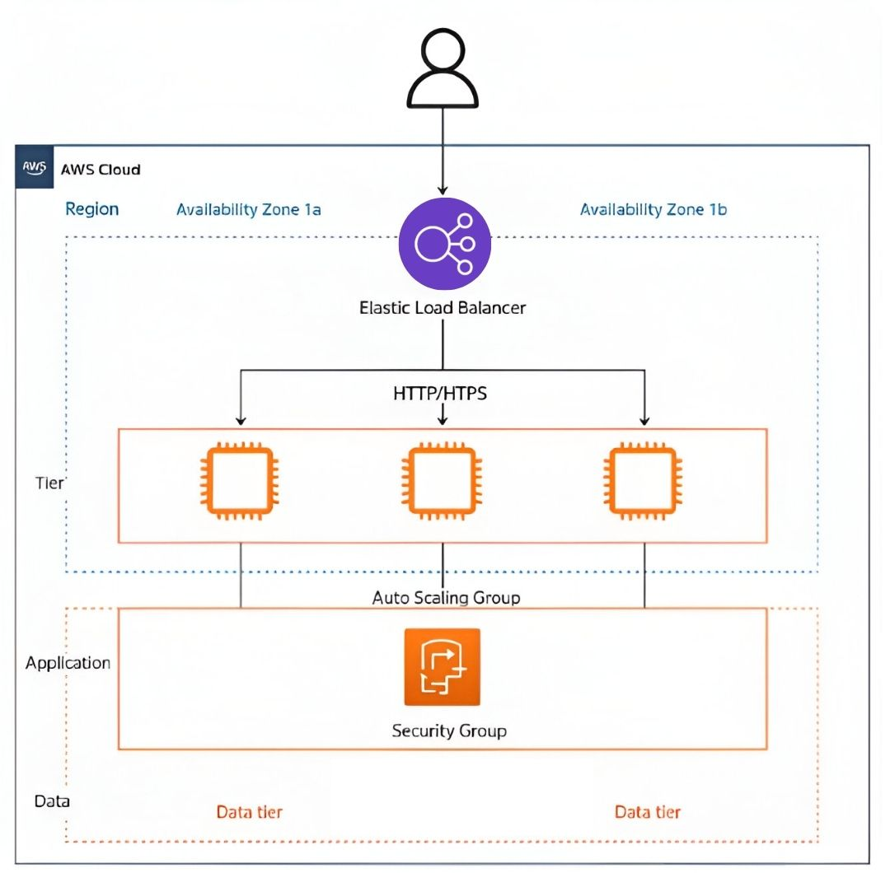

# Architecture

The architecture follows the principles of **high availability** and **scalability** within AWS.

## Components

- **Elastic Load Balancer (ELB):** Distributes incoming traffic across multiple availability zones to ensure redundancy and availability.
- **EC2 Instances:** Host the application and report their load/concurrency levels.
- **Auto Scaling Group (ASG):** Manages the lifecycle of EC2 instances, launching or terminating them based on demand.
- **Launch Template:** Provides configuration for launching new instances, including AMI, instance type, and security groups.
- **CloudWatch Metrics & Alarms:** Monitor system performance and trigger automatic scaling actions based on defined thresholds.

## Network Access Explanation

The architecture is designed to enforce secure and controlled traffic flow by applying strict access rules through security groups:

- 🔴 **Direct access from users to EC2 instances** → ❌ **Not allowed.**  
  These routes are intentionally blocked to prevent public exposure of the EC2 instances. This is represented by the red crosses in the diagram.

- ✅ **Access from users to the Load Balancer** → ✔️ **Allowed.**  
  The Load Balancer serves as the single entry point to the system, improving both security and traffic management.

This configuration minimizes attack surfaces while ensuring availability, scalability, and proper separation of concerns.

