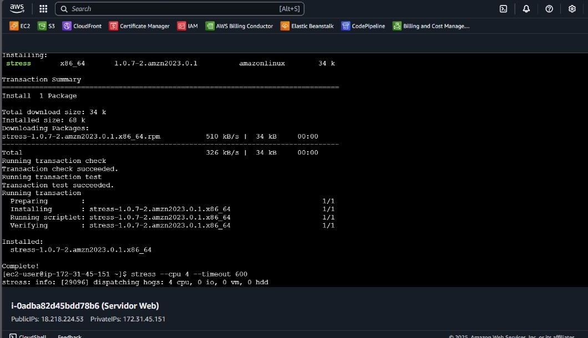

# Dynamic Deployment

Dynamic scaling was implemented to automatically adjust the number of instances based on actual resource usage, such as CPU and concurrency. This approach ensures the system can efficiently handle unexpected loads.

## Implementation

1. **Launch Template with EFS:**

   - The Launch Template includes the base configuration for the instances.


2. **Installing `stress`:**

   - To test dynamic scaling, the `stress` tool was installed on the instances using the following command:
     ```bash
     sudo apt install -y stress
     ```



3. **Auto Scaling Group (ASG) Configuration:**

   - The ASG was configured with a minimum of 2 instances and a maximum of 4 instances.
   - Dynamic scaling policies were created based on the `CPUUtilization` metric:
     - **Scale up:** If CPU > 70% for 2 minutes, add one instance.
     - **Scale down:** If CPU < 30% for 5 minutes, remove one instance.


4. **Load Generation with `stress`:**

   - During testing, artificial load was generated with `stress` to observe how the system responded:

5. **Access via Load Balancer:**
   - As with previous deployments, traffic can only access the instances through the Load Balancer's DNS, with direct IP access blocked.

Original


Replica 2


Replica 3


Just using the navigator.


History


## Validation

- Load was generated using `stress`, and it was observed how the ASG automatically scaled the number of instances.
- Verified that all instances accessed EFS content and responded correctly under load.
