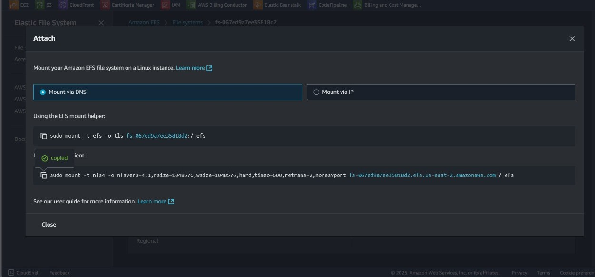
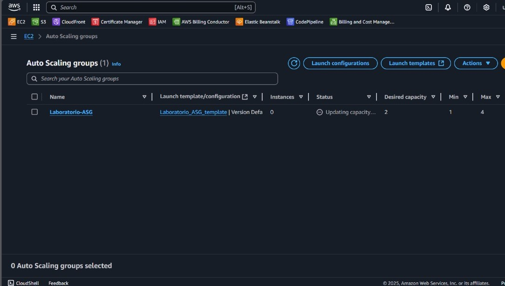
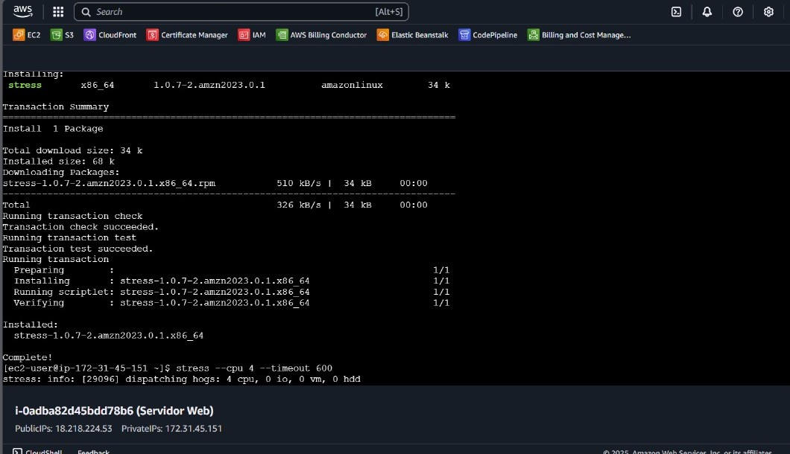
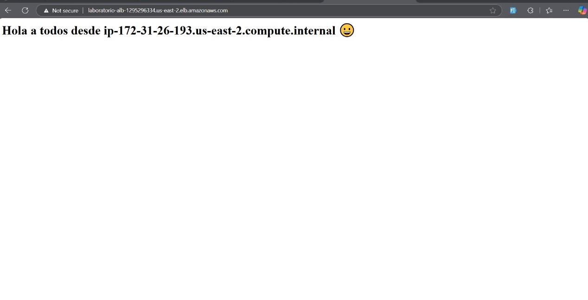
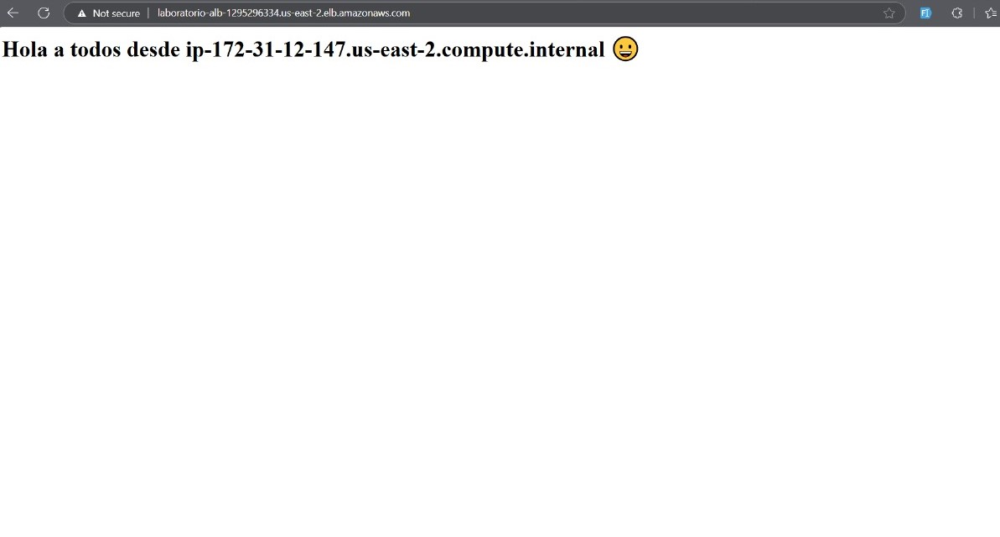
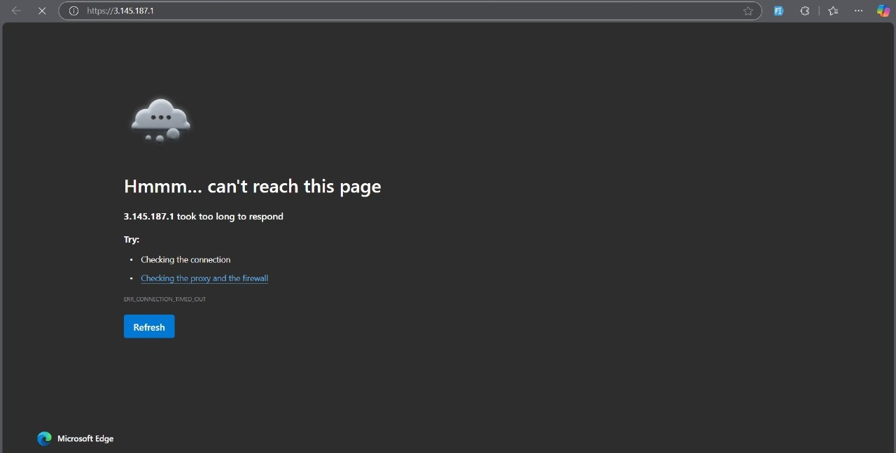

# Manual Deployment

Manual deployment was implemented to have full control over the number of running EC2 instances. This allows manually adjusting the number of instances based on load without relying on automatic policies.

## Implementation

1. **Launch Template:**
   A Launch Template was created, which includes the base configuration of the EC2 instances.

2. **EFS Configuration:**

   - An EFS file system was created and configured as a mount point on each instance using the following script:
     ```bash
     sudo apt update && sudo apt install -y nfs-common
     mkdir /mnt/efs
     mount -t nfs4 -o nfsvers=4.1 fs-xxxxxx.efs.region.amazonaws.com:/ /mnt/efs
     ```
     This ensures that all instances, whether new or existing, have access to the same content.



3. **Auto Scaling Group (ASG):**

   - Although the ASG is configured, scaling is done manually. Added 1 instance. Instances are adjusted from the AWS console.



4. **Installing `stress`:**

   - The `stress` tool was installed on the instances to generate artificial load and test manual scaling capacity with the following command:
     ```bash
     sudo apt install -y stress
     ```



5. **Access via Load Balancer:**
   - A Load Balancer (ELB) was configured to handle incoming traffic and redirect it to the EC2 instances. Direct IP access is blocked, ensuring all traffic flows through the ELB DNS.

Original


Replica


Just using the navigator.


## Validation

- Accessed the ELB DNS and verified that new instances were properly integrated into the load balancer.
- Manually adjusted the ASG, increasing and decreasing the number of instances as needed.
- Verified that new instances had access to the shared content from EFS and responded correctly to traffic.
