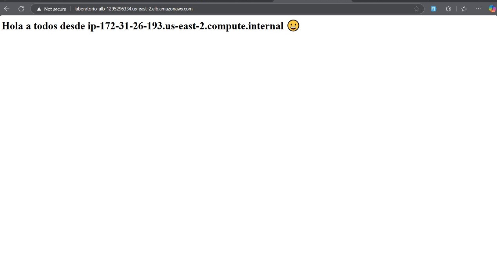
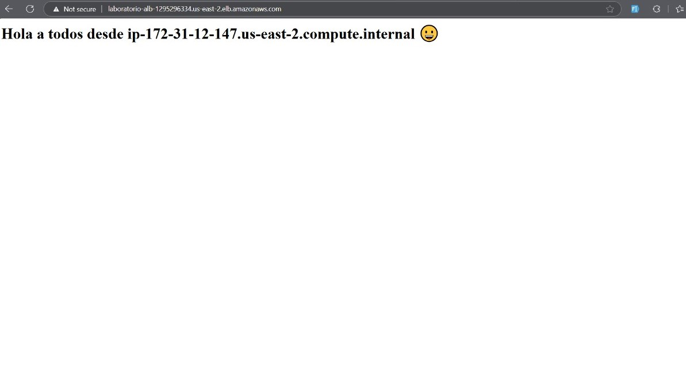

# Scheduled Deployment

Scheduled scaling was implemented to automatically adjust the number of instances based on predefined schedules, optimizing resources during traffic peaks.

## Implementation

1. **Launch Template with EFS:**

   - A Launch Template similar to the manual deployment was used, but with the difference that scaling is triggered automatically based on specifications.


2. **Installing `stress`:**

   - To simulate load on the instances and test scaling behavior, `stress` was installed on the instances:
     ```bash
     sudo apt install -y stress
     ```


3. **Configuring the Auto Scaling Group (ASG):**

   - Scheduled scaling policies were configured using the AWS console


4. **Testing with `stress`:**

   - During the project hours, `stress` was run on the instances to check how they responded to scaling.

5. **Access via Load Balancer:**
   - A Load Balancer was configured to handle incoming traffic, ensuring access is only made through its DNS, and direct IP access was blocked.

Load Balancer


Original


Replica 2



Replica 3


Replica 4


Just using the navigator.


Register


History


## Validation

- Verified that instances scaled correctly according to the scheduled time.
- Validated that new instances could access the shared content from EFS.
- Monitored the load on the instances using `stress` and verified the system's response.
